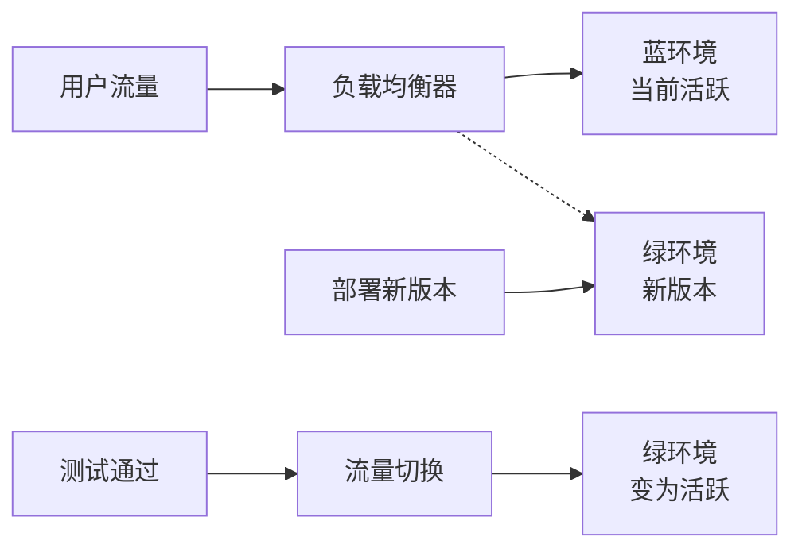

# 现代前端工程化实践指南

在当今复杂的前端开发环境中，工程化已经成为每个前端团队必须面对的课题。本文将系统地探讨现代前端工程化的各个方面，从开发环境搭建到持续集成与部署，帮助你构建高效、可靠的前端工程体系。

## 目录

- [前端工程化的发展](#前端工程化的发展)
- [构建工具选型](#构建工具选型)
- [包管理策略](#包管理策略)
- [模块化设计](#模块化设计)
- [代码规范与质量](#代码规范与质量)
- [自动化测试方案](#自动化测试方案)
- [持续集成与部署](#持续集成与部署)
- [性能监控与优化](#性能监控与优化)
- [大型项目最佳实践](#大型项目最佳实践)

## 前端工程化的发展

前端工程化经历了从简单脚本到复杂工程体系的演变，这一过程反映了前端技术的快速发展和复杂度的不断提升。

### 早期阶段：文件级组织

最初，前端开发主要是通过HTML、CSS和JavaScript文件的简单组织，没有明确的构建过程：

```html
<!DOCTYPE html>
<html>
<head>
  <link rel="stylesheet" href="styles.css">
  <script src="jquery.js"></script>
  <script src="app.js"></script>
</head>
<body>
  <!-- 页面内容 -->
</body>
</html>
```

这种方式在小型项目中运行良好，但随着项目规模扩大，很快变得难以维护。

### 中期阶段：任务运行器和模块化

随着Grunt、Gulp等任务运行器和CommonJS、AMD等模块化规范的出现，前端开发开始引入构建流程和模块化思想：

```javascript
// Gulpfile.js
const gulp = require('gulp');
const sass = require('gulp-sass');
const babel = require('gulp-babel');

gulp.task('styles', () => {
  return gulp.src('./src/styles/*.scss')
    .pipe(sass().on('error', sass.logError))
    .pipe(gulp.dest('./dist/css'));
});

gulp.task('scripts', () => {
  return gulp.src('./src/scripts/*.js')
    .pipe(babel({ presets: ['@babel/env'] }))
    .pipe(gulp.dest('./dist/js'));
});

gulp.task('default', gulp.parallel('styles', 'scripts'));
```

### 现代阶段：一体化工程方案

现在，我们已经发展到了以Webpack、Vite为代表的一体化前端工程方案，结合了模块打包、代码转换、资源处理等多种功能：

```javascript
// webpack.config.js
const path = require('path');
const HtmlWebpackPlugin = require('html-webpack-plugin');
const MiniCssExtractPlugin = require('mini-css-extract-plugin');

module.exports = {
  entry: './src/index.js',
  output: {
    path: path.resolve(__dirname, 'dist'),
    filename: '[name].[contenthash].js'
  },
  module: {
    rules: [
      {
        test: /\.jsx?$/,
        exclude: /node_modules/,
        use: {
          loader: 'babel-loader',
          options: {
            presets: ['@babel/preset-env', '@babel/preset-react']
          }
        }
      },
      {
        test: /\.scss$/,
        use: [
          MiniCssExtractPlugin.loader,
          'css-loader',
          'sass-loader'
        ]
      }
    ]
  },
  plugins: [
    new HtmlWebpackPlugin({
      template: './src/index.html'
    }),
    new MiniCssExtractPlugin({
      filename: '[name].[contenthash].css'
    })
  ],
  optimization: {
    splitChunks: {
      chunks: 'all'
    }
  }
};
```

## 构建工具选型

### Webpack vs Vite

在现代前端工程化中，构建工具的选择直接影响开发体验和项目性能。以下是Webpack和Vite的详细对比：

#### Webpack的优势

- 生态系统成熟，插件丰富
- 高度可配置，几乎可以处理任何场景
- 对旧版浏览器的支持更完善
- 在大型项目的生产构建方面表现稳定

```javascript
// Webpack的模块热替换配置
module.exports = {
  // ...
  devServer: {
    hot: true,
    port: 3000
  },
  plugins: [
    new webpack.HotModuleReplacementPlugin()
  ]
};
```

#### Vite的优势

- 开发服务器启动速度极快（利用浏览器原生ES模块）
- 按需编译，提供更快的热更新体验
- 内置TypeScript、JSX、CSS预处理器支持
- 构建基于Rollup，产物更小更优

```javascript
// vite.config.js
export default {
  plugins: [react()],
  server: {
    port: 3000,
    hmr: true
  },
  build: {
    rollupOptions: {
      output: {
        manualChunks: {
          vendor: ['react', 'react-dom']
        }
      }
    }
  }
};
```

### 如何选择合适的构建工具

选择构建工具时应考虑以下因素：

1. **项目规模**：小到中型项目可优先考虑Vite，开发体验更佳；大型项目可能需要Webpack的成熟稳定性
2. **团队熟悉度**：考虑团队对工具的熟悉程度，避免额外的学习成本
3. **特殊需求**：如需支持IE11等旧浏览器，Webpack可能是更好的选择
4. **构建性能要求**：如开发启动速度和热更新体验是关键，Vite有明显优势

## 包管理策略

### 包管理器对比：npm vs yarn vs pnpm

现代前端项目的包管理已经远超过简单的依赖安装，需要考虑安装速度、磁盘空间利用和依赖锁定等多方面因素。

| 特性 | npm | yarn | pnpm |
|-----|-----|------|------|
| 安装速度 | 中等 | 快 | 最快 |
| 磁盘空间 | 高 | 高 | 低（硬链接） |
| 依赖解析 | 树形 | 树形 | 平铺 |
| Monorepo支持 | 通过workspaces | 通过workspaces | 原生支持 |
| 安全性 | 一般 | 高 | 高 |

### 依赖管理最佳实践

1. **版本锁定**：使用lockfile（package-lock.json, yarn.lock, pnpm-lock.yaml）确保团队一致性

2. **依赖分类**：明确区分开发依赖和生产依赖
   ```bash
   # 开发依赖
   npm install --save-dev eslint
   # 生产依赖
   npm install --save react
   ```

3. **定期更新与审核**：
   ```bash
   # 查找过时的包
   npm outdated
   # 安全审计
   npm audit
   ```

4. **清晰的语义化版本控制**：
   - `^1.2.3`: 允许更新到1.x.x系列的任何版本
   - `~1.2.3`: 只允许更新补丁版本（1.2.x）
   - `1.2.3`: 锁定到特定版本

## 模块化设计

### JavaScript模块化方案演进

JavaScript模块化经历了多种标准的演进：

1. **全局变量/命名空间**：早期解决方案，容易造成命名冲突
   ```javascript
   // 命名空间模式
   var MyApp = MyApp || {};
   MyApp.utils = {
     formatDate: function() { /* ... */ }
   };
   ```

2. **CommonJS**：Node.js采用的模块规范
   ```javascript
   // math.js
   module.exports = {
     add: (a, b) => a + b
   };
   
   // main.js
   const math = require('./math');
   console.log(math.add(1, 2)); // 3
   ```

3. **AMD/RequireJS**：浏览器端模块加载方案
   ```javascript
   define(['jquery'], function($) {
     return {
       showMessage: function(msg) {
         $('body').append('<p>' + msg + '</p>');
       }
     };
   });
   ```

4. **ES Modules**：现代JavaScript标准模块系统
   ```javascript
   // math.js
   export const add = (a, b) => a + b;
   
   // main.js
   import { add } from './math.js';
   console.log(add(1, 2)); // 3
   ```

### 模块化最佳实践

1. **单一职责原则**：每个模块应该专注于一个功能点
   ```javascript
   // 好的实践
   // user-auth.js - 只处理用户认证
   export function login() { /* ... */ }
   export function logout() { /* ... */ }

   // user-profile.js - 只处理用户资料
   export function getUserProfile() { /* ... */ }
   export function updateUserProfile() { /* ... */ }
   ```

2. **明确的公共API**：使用命名导出清晰表达模块接口
   ```javascript
   // 导出明确定义的API
   export { login, logout, validateToken };
   
   // 避免默认导出大对象
   // 不推荐: export default { login, logout, validateToken };
   ```

3. **路径别名**：简化模块导入路径
   ```javascript
   // webpack配置
   resolve: {
     alias: {
       '@components': path.resolve(__dirname, 'src/components'),
       '@utils': path.resolve(__dirname, 'src/utils')
     }
   }
   
   // 使用
   import Button from '@components/Button';
   import { formatDate } from '@utils/date';
   ```

## 代码规范与质量

### 代码规范工具链

统一的代码规范对于团队协作至关重要，现代前端项目通常使用以下工具构建规范体系：

#### ESLint配置

```javascript
// .eslintrc.js
module.exports = {
  extends: [
    'eslint:recommended',
    'plugin:react/recommended',
    'plugin:@typescript-eslint/recommended'
  ],
  plugins: ['react', '@typescript-eslint'],
  rules: {
    'react/prop-types': 'off',
    '@typescript-eslint/explicit-module-boundary-types': 'off',
    'no-console': ['warn', { allow: ['warn', 'error'] }]
  },
  settings: {
    react: {
      version: 'detect'
    }
  }
};
```

#### Prettier配置

```javascript
// .prettierrc
{
  "semi": true,
  "singleQuote": true,
  "tabWidth": 2,
  "trailingComma": "es5",
  "printWidth": 100,
  "bracketSpacing": true
}
```

#### 结合ESLint和Prettier

```javascript
// 安装必要依赖
// npm install --save-dev eslint-config-prettier eslint-plugin-prettier

// .eslintrc.js
module.exports = {
  extends: [
    // ...其他扩展
    'plugin:prettier/recommended'
  ]
};
```

### Git钩子与提交规范

使用Git钩子可以在代码提交前自动检查和修复问题：

#### Husky配置

```javascript
// package.json
{
  "husky": {
    "hooks": {
      "pre-commit": "lint-staged",
      "commit-msg": "commitlint -E HUSKY_GIT_PARAMS"
    }
  },
  "lint-staged": {
    "*.{js,jsx,ts,tsx}": [
      "eslint --fix",
      "prettier --write"
    ],
    "*.{css,scss,less}": [
      "prettier --write"
    ]
  }
}
```

#### 提交信息规范化 (Commitlint)

```javascript
// commitlint.config.js
module.exports = {
  extends: ['@commitlint/config-conventional'],
  rules: {
    'type-enum': [
      2,
      'always',
      [
        'feat', // 新功能
        'fix',  // 修复bug
        'docs', // 文档更新
        'style', // 样式修改
        'refactor', // 重构
        'perf', // 性能优化
        'test', // 测试
        'chore', // 构建过程或辅助工具变动
        'revert' // 回退
      ]
    ]
  }
};
```

## 自动化测试方案

### 测试金字塔

现代前端测试遵循测试金字塔模型，从上到下依次是：

1. **端到端测试（E2E）**：少量，测试完整用户流程
2. **集成测试**：中等数量，测试组件间交互
3. **单元测试**：大量，测试独立函数和组件

### 单元测试与集成测试

以React组件测试为例，使用Jest和React Testing Library：

```javascript
// Button.test.tsx
import { render, fireEvent, screen } from '@testing-library/react';
import Button from './Button';

describe('Button组件', () => {
  test('渲染正确的文本', () => {
    render(<Button>点击我</Button>);
    expect(screen.getByText('点击我')).toBeInTheDocument();
  });

  test('点击时触发onClick事件', () => {
    const handleClick = jest.fn();
    render(<Button onClick={handleClick}>点击我</Button>);
    fireEvent.click(screen.getByText('点击我'));
    expect(handleClick).toHaveBeenCalledTimes(1);
  });
});
```

### 端到端测试

使用Cypress进行端到端测试：

```javascript
// login.spec.js
describe('登录功能', () => {
  it('使用有效凭据登录成功', () => {
    cy.visit('/login');
    
    cy.get('[data-testid=username]').type('testuser');
    cy.get('[data-testid=password]').type('password123');
    cy.get('[data-testid=login-button]').click();
    
    // 验证登录成功跳转
    cy.url().should('include', '/dashboard');
    // 验证欢迎消息
    cy.get('[data-testid=welcome-message]').should('contain', 'Welcome, testuser');
  });
});
```

### 测试覆盖率与质量目标

```bash
# Jest配置测试覆盖率
jest --coverage
```

推荐的覆盖率目标：
- 单元测试：80%+
- 集成测试：60%+
- 端到端测试：关键流程100%

## 持续集成与部署

### CI/CD流水线构建

以GitHub Actions为例，构建现代前端CI/CD流水线：

```yaml
# .github/workflows/ci.yml
name: CI/CD Pipeline

on:
  push:
    branches: [ main, dev ]
  pull_request:
    branches: [ main ]

jobs:
  test:
    runs-on: ubuntu-latest
    steps:
      - uses: actions/checkout@v3
      - uses: actions/setup-node@v3
        with:
          node-version: 16
      - name: Install dependencies
        run: npm ci
      - name: Lint
        run: npm run lint
      - name: Test
        run: npm test -- --coverage
      - name: Upload coverage
        uses: codecov/codecov-action@v2

  build:
    needs: test
    runs-on: ubuntu-latest
    steps:
      - uses: actions/checkout@v3
      - uses: actions/setup-node@v3
        with:
          node-version: 16
      - name: Install dependencies
        run: npm ci
      - name: Build
        run: npm run build
      - name: Upload build artifacts
        uses: actions/upload-artifact@v3
        with:
          name: build
          path: dist/

  deploy:
    if: github.ref == 'refs/heads/main'
    needs: build
    runs-on: ubuntu-latest
    steps:
      - uses: actions/download-artifact@v3
        with:
          name: build
          path: dist/
      - name: Deploy to production
        uses: FirebaseExtended/action-hosting-deploy@v0
        with:
          repoToken: "${{ secrets.GITHUB_TOKEN }}"
          firebaseServiceAccount: "${{ secrets.FIREBASE_SERVICE_ACCOUNT }}"
          channelId: live
```

### 部署策略

#### 蓝绿部署

蓝绿部署通过维护两套完全相同的环境，实现零停机切换：



#### 金丝雀发布

通过将小部分流量引导到新版本，逐步验证并扩大发布范围：

```javascript
// 使用Kubernetes进行金丝雀发布
apiVersion: networking.istio.io/v1alpha3
kind: VirtualService
metadata:
  name: frontend-service
spec:
  hosts:
    - frontend.example.com
  http:
    - route:
      - destination:
          host: frontend-v1
          port:
            number: 80
        weight: 80
      - destination:
          host: frontend-v2
          port:
            number: 80
        weight: 20
```

## 性能监控与优化

### 前端性能指标

关键性能指标及其目标值：

| 指标 | 描述 | 目标值 |
|-----|------|-------|
| FCP (First Contentful Paint) | 首次有内容渲染 | < 1.8s |
| LCP (Largest Contentful Paint) | 最大内容渲染 | < 2.5s |
| TTI (Time to Interactive) | 可交互时间 | < 3.8s |
| TBT (Total Blocking Time) | 总阻塞时间 | < 200ms |
| CLS (Cumulative Layout Shift) | 累积布局偏移 | < 0.1 |

### 性能监控系统

#### 使用Lighthouse CI自动化性能评估

```javascript
// lighthouserc.js
module.exports = {
  ci: {
    collect: {
      url: ['https://example.com/', 'https://example.com/about'],
      numberOfRuns: 3,
    },
    assert: {
      preset: 'lighthouse:recommended',
      assertions: {
        'first-contentful-paint': ['warn', { maxNumericValue: 2000 }],
        'interactive': ['error', { maxNumericValue: 3800 }],
        'cumulative-layout-shift': ['error', { maxNumericValue: 0.1 }],
      }
    },
    upload: {
      target: 'temporary-public-storage',
    },
  },
};
```

#### 前端监控SDK实现

```javascript
// 简化的性能监控SDK
class PerformanceMonitor {
  constructor(endpoint) {
    this.endpoint = endpoint;
    this.metrics = {};
    this.init();
  }

  init() {
    // 收集Web Vitals
    this.collectWebVitals();
    // 收集资源加载性能
    this.collectResourceTiming();
    // 收集JS错误
    this.collectErrors();
  }

  collectWebVitals() {
    import('web-vitals').then(({ getCLS, getFID, getLCP }) => {
      getCLS(metric => this.saveMetric('CLS', metric.value));
      getFID(metric => this.saveMetric('FID', metric.value));
      getLCP(metric => this.saveMetric('LCP', metric.value));
    });
  }

  saveMetric(name, value) {
    this.metrics[name] = value;
    // 当收集到足够的指标时上报
    if (Object.keys(this.metrics).length >= 3) {
      this.sendToAnalytics();
    }
  }

  sendToAnalytics() {
    // 上报到服务器
    navigator.sendBeacon(this.endpoint, JSON.stringify(this.metrics));
  }
}

// 使用
new PerformanceMonitor('https://analytics.example.com/collect');
```

## 大型项目最佳实践

### Monorepo架构

大型前端项目可采用Monorepo方式组织代码，提升代码共享和版本管理效率：

```
my-monorepo/
├── package.json
├── packages/
│   ├── core/            # 核心库
│   ├── components/      # 组件库
│   ├── utils/           # 通用工具
│   ├── app-admin/       # 管理后台
│   └── app-client/      # 客户端应用
├── tools/               # 构建工具和脚本
└── docs/                # 项目文档
```

使用Lerna或Nx管理Monorepo：

```json
// lerna.json
{
  "version": "independent",
  "npmClient": "yarn",
  "useWorkspaces": true,
  "packages": ["packages/*"],
  "command": {
    "publish": {
      "conventionalCommits": true,
      "message": "chore(release): publish"
    }
  }
}
```

### 微前端架构

微前端架构适用于特大型前端应用，实现团队自主开发部署：


基本实现方式：

```javascript
// 主应用
import { registerApplication, start } from 'single-spa';

// 注册子应用
registerApplication({
  name: 'app1',
  app: () => import('@org/app1'),
  activeWhen: (location) => location.pathname.startsWith('/app1')
});

registerApplication({
  name: 'app2',
  app: () => import('@org/app2'),
  activeWhen: (location) => location.pathname.startsWith('/app2')
});

// 启动框架
start();
```

### 设计系统与组件库

大型项目应构建自己的设计系统和组件库：

```tsx
// Button组件示例
import React from 'react';
import styled from 'styled-components';
import { theme } from '../theme';

type ButtonVariant = 'primary' | 'secondary' | 'danger';
type ButtonSize = 'small' | 'medium' | 'large';

interface ButtonProps {
  variant?: ButtonVariant;
  size?: ButtonSize;
  disabled?: boolean;
  fullWidth?: boolean;
  children: React.ReactNode;
  onClick?: () => void;
}

const StyledButton = styled.button<{
  variant: ButtonVariant;
  size: ButtonSize;
  $fullWidth: boolean;
}>`
  display: inline-flex;
  align-items: center;
  justify-content: center;
  border-radius: ${theme.radii.md};
  font-weight: 500;
  transition: all 0.2s;
  cursor: ${props => props.disabled ? 'not-allowed' : 'pointer'};
  opacity: ${props => props.disabled ? 0.6 : 1};
  width: ${props => props.$fullWidth ? '100%' : 'auto'};
  
  /* 变体样式 */
  ${props => {
    switch (props.variant) {
      case 'primary':
        return `
          background-color: ${theme.colors.primary};
          color: white;
          &:hover:not(:disabled) {
            background-color: ${theme.colors.primaryDark};
          }
        `;
      case 'secondary':
        return `
          background-color: ${theme.colors.secondary};
          color: ${theme.colors.text};
          &:hover:not(:disabled) {
            background-color: ${theme.colors.secondaryDark};
          }
        `;
      case 'danger':
        return `
          background-color: ${theme.colors.danger};
          color: white;
          &:hover:not(:disabled) {
            background-color: ${theme.colors.dangerDark};
          }
        `;
    }
  }}
  
  /* 尺寸样式 */
  ${props => {
    switch (props.size) {
      case 'small':
        return `
          padding: 8px 16px;
          font-size: 14px;
        `;
      case 'medium':
        return `
          padding: 12px 20px;
          font-size: 16px;
        `;
      case 'large':
        return `
          padding: 16px 24px;
          font-size: 18px;
        `;
    }
  }}
`;

export const Button = ({
  variant = 'primary',
  size = 'medium',
  disabled = false,
  fullWidth = false,
  children,
  onClick,
  ...rest
}: ButtonProps) => {
  return (
    <StyledButton
      variant={variant}
      size={size}
      disabled={disabled}
      $fullWidth={fullWidth}
      onClick={!disabled ? onClick : undefined}
      {...rest}
    >
      {children}
    </StyledButton>
  );
};
```

## 总结

现代前端工程化是一个体系化工程，需要从构建工具、模块管理、代码规范、测试策略、CI/CD到性能监控形成完整闭环。随着项目规模扩大，合理的工程化实践能够：

- 提高团队开发效率
- 保证代码质量和一致性
- 加速迭代速度
- 提升应用性能和用户体验

通过合理选择和配置各类工具，构建适合团队的工程化体系，将为前端项目的长期发展奠定坚实基础。

## 扩展阅读

- [Webpack官方文档](https://webpack.js.org/)
- [Vite官方文档](https://vitejs.dev/)
- [现代JavaScript教程](https://javascript.info/)
- [前端性能优化指南](https://web.dev/fast/)
- [微前端架构与实践](https://micro-frontends.org/) 