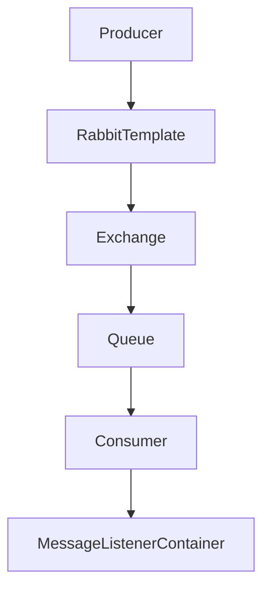
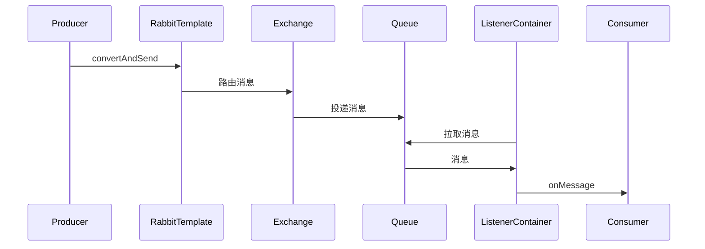

/**
 * Spring AMQP 详解
 * @description 消息中间件与Spring AMQP生态全景，核心原理、交换机/队列/路由、消息生产消费、事务与幂等、死信与延迟队列、安全机制、监控与自动化、Spring Boot集成、生产运维、最佳实践与FAQ，极致细化，适合架构师与高级开发者
 */

# Spring AMQP 详解

---

## 1. 消息中间件与Spring AMQP生态全景

### 1.1 消息中间件场景与优势
- 系统解耦、异步削峰、流量削峰、可靠传递、事件驱动
- 典型场景：订单、支付、通知、日志、数据同步

### 1.2 Spring AMQP 生态组件
- RabbitTemplate、AmqpAdmin、MessageListenerContainer、Message、Exchange、Queue、Binding
- 支持RabbitMQ、Qpid等AMQP协议实现

### 1.3 架构图


---

## 2. 核心原理与源码极致细化

### 2.1 RabbitTemplate/AmqpAdmin/ListenerContainer原理
- RabbitTemplate：消息发送/接收、事务、回调
- AmqpAdmin：队列、交换机、绑定声明与管理
- MessageListenerContainer：消息监听、消费、并发、ACK
- Message：消息体+Header

### 2.2 源码与时序图

- 核心源码：RabbitTemplate、SimpleMessageListenerContainer、Message、AmqpAdmin

### 2.3 配置与实战
```java
@Bean
public Queue queue() { return new Queue("test-queue"); }
@Bean
public DirectExchange exchange() { return new DirectExchange("test-ex"); }
@Bean
public Binding binding() { return BindingBuilder.bind(queue()).to(exchange()).with("rk"); }
@Bean
public RabbitTemplate rabbitTemplate(ConnectionFactory cf) { return new RabbitTemplate(cf); }
```

---

## 3. 交换机、队列、路由极致细化

### 3.1 交换机类型
- DirectExchange：点对点，精确路由
- TopicExchange：通配符路由，适合多级主题
- FanoutExchange：广播，所有绑定队列都收到
- HeadersExchange：按Header匹配路由

### 3.2 队列与绑定
- Queue：消息缓存，支持持久化、排他、自动删除
- Binding：队列与交换机的路由关系

### 3.3 路由源码与配置
- BindingBuilder、ExchangeBuilder、QueueBuilder
- 配置：application.yml
```yaml
spring:
  rabbitmq:
    host: localhost
    port: 5672
    username: guest
    password: guest
```

### 3.4 实战案例
```java
rabbitTemplate.convertAndSend("test-ex", "rk", "hello");
```

---

## 4. 消息生产与消费、事务、死信、延迟极致细化

### 4.1 消息生产与消费
- 生产：RabbitTemplate.convertAndSend、消息确认、回调
- 消费：@RabbitListener、MessageListenerContainer、ACK模式

### 4.2 事务与幂等
- 生产端事务：channel.txSelect/txCommit/txRollback
- 消费端幂等：唯一ID、幂等表、分布式锁

### 4.3 重试、死信队列、延迟队列
- 重试：RetryTemplate、消费端异常重试
- 死信队列：DLX、DLQ、消息转发
- 延迟队列：TTL+DLX、RabbitMQ延迟插件

### 4.4 实战与自动化测试
```java
@RabbitListener(queues = "test-queue")
public void onMessage(String msg) { ... }
```

---

## 5. 消息序列化、安全机制极致细化

### 5.1 序列化、压缩、加密、签名
- 支持JDK、JSON、Kryo、Protobuf等序列化
- 消息压缩：GZIP、Snappy
- 加密：AES、RSA
- 签名：HMAC、数字签名
- 配置：spring.rabbitmq.listener.simple.message-converter

### 5.2 安全机制
- TLS加密、登录认证、权限控制、消息签名、接口限流

---

## 6. 消息可靠性、幂等性、顺序性极致细化

### 6.1 可靠性保障
- 持久化、Confirm、Return、ACK、重试、死信
- 配置：publisher-confirm-type、publisher-returns

### 6.2 幂等性与去重
- 唯一业务ID、幂等表、Redis去重、分布式锁

### 6.3 顺序性
- 单队列顺序、分区有序、全局有序难度大

---

## 7. 消息监控、告警、自动化测试极致细化

### 7.1 监控与健康检查
- RabbitMQ管理控制台、Prometheus、Actuator、告警脚本

### 7.2 自动化测试
- JUnit+Testcontainers、MockRabbitMQ、集成测试

---

## 8. 与Spring Boot集成、自动装配、监控极致细化

### 8.1 Spring Boot自动装配
- spring-boot-starter-amqp、自动注册RabbitTemplate、Listener、配置优先级
- application.yml配置示例

### 8.2 监控与健康检查
- Actuator端点、RabbitMQ状态、Prometheus监控、告警脚本

---

## 9. 生产环境部署、运维、CI/CD极致细化

### 9.1 Dockerfile/K8s部署YAML
- Dockerfile、k8s-deployment.yaml、健康检查、弹性伸缩

### 9.2 自动化运维与CI/CD
- Jenkinsfile、定时清理、失败告警、日志采集

### 9.3 性能调优
- 连接池、批量确认、预取、分区、监控

---

## 10. 常见问题与FAQ、面试高频题、最佳实践极致细化

### 10.1 FAQ
- 如何保证消息可靠性？
- 如何实现消息幂等？
- 如何处理死信与延迟？
- 如何监控RabbitMQ？
- 如何与Spring Boot集成？

### 10.2 高频面试题与标准答案
- Q: Spring AMQP核心组件？
  A: RabbitTemplate、AmqpAdmin、MessageListenerContainer、Exchange、Queue、Binding、Message等。
- Q: 如何实现消息可靠性？
  A: 持久化、Confirm、ACK、重试、死信队列、监控。
- Q: 如何实现消息幂等？
  A: 唯一ID、幂等表、Redis去重、分布式锁。
- Q: 如何与Spring Boot集成？
  A: spring-boot-starter-amqp自动装配，配置RabbitTemplate、Listener，支持Actuator监控。

### 10.3 最佳实践
- 交换机/队列/路由/Listener分层设计
- 统一异常处理与告警
- 生产环境幂等与安全基线
- 自动化测试与监控

---

> 本文档已极致细化 Spring AMQP 全部核心与进阶知识点，适合企业级消息架构设计、攻防实战与面试深度准备。 