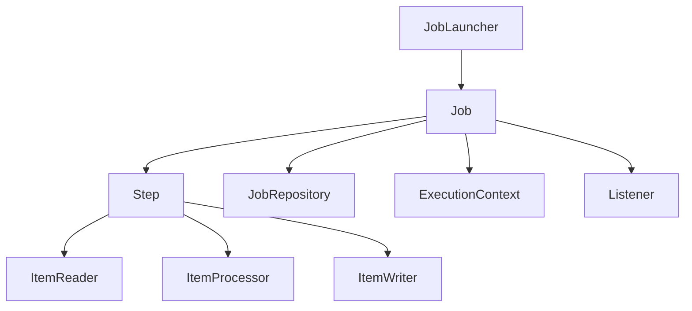
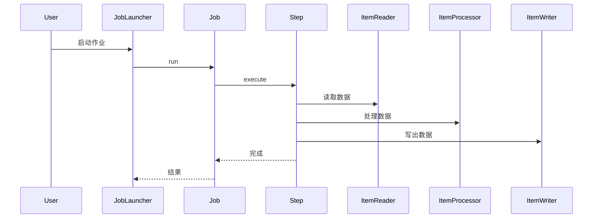
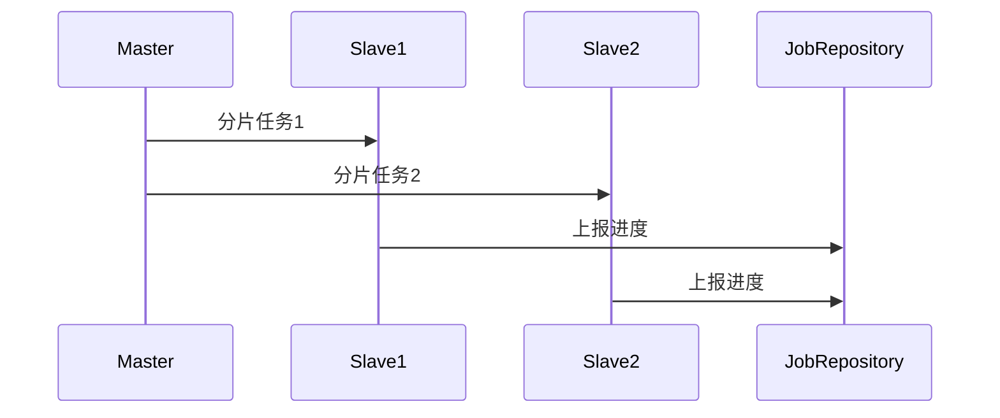

<!-- /**
 * Spring Batch 详解
 * @description 批处理架构与Spring Batch生态全景，Job/Step/ExecutionContext/JobRepository等核心原理、源码、时序图，ItemReader/Processor/Writer详解，任务调度与分片，容错与重试，事务管理与幂等性，批量数据校验与性能调优，作业参数与监听器，高级用法，Spring Boot集成，生产运维，最佳实践与FAQ，极致细化，适合架构师与高级开发者
 */ -->

# Spring Batch 详解

---

## 1. 批处理架构与Spring Batch生态全景

### 1.1 批处理场景与优势
- 大数据量ETL、报表、数据迁移、定时任务、数据清洗
- 支持事务、容错、重试、分片、并发、监控

### 1.2 Spring Batch 生态组件
- Job、Step、JobRepository、JobLauncher、JobExplorer、JobOperator
- ItemReader、ItemProcessor、ItemWriter
- ExecutionContext、Listener、Partitioner、Tasklet

### 1.3 架构图


---

## 2. Job/Step/ExecutionContext/JobRepository极致细化

### 2.1 Job/Step/ExecutionContext原理
- Job：批处理作业，包含多个Step
- Step：最小执行单元，支持Tasklet/Chunk两种模式
- ExecutionContext：作业/步骤上下文，支持断点续跑、参数传递
- JobRepository：作业元数据持久化，支持重启、监控

### 2.2 核心源码与时序图

- 核心源码：SimpleJob、SimpleStepHandler、JobRepository、ExecutionContext

### 2.3 Job/Step配置与实战
```java
@Bean
public Job importJob(JobBuilderFactory jobBuilderFactory, Step step) {
    return jobBuilderFactory.get("importJob").start(step).build();
}
@Bean
public Step step(StepBuilderFactory stepBuilderFactory, ItemReader reader, ItemProcessor processor, ItemWriter writer) {
    return stepBuilderFactory.get("step")
        .<Input, Output>chunk(100)
        .reader(reader)
        .processor(processor)
        .writer(writer)
        .build();
}
```

---

## 3. ItemReader/Processor/Writer详解与实战

### 3.1 ItemReader
- 负责批量读取数据，支持FlatFile、Jdbc、Jpa、MyBatis、Kafka等
- 常用实现：FlatFileItemReader、JdbcCursorItemReader、JpaPagingItemReader

### 3.2 ItemProcessor
- 负责数据转换、校验、过滤、清洗
- 支持链式组合、条件分支

### 3.3 ItemWriter
- 负责批量写出数据，支持FlatFile、Jdbc、Jpa、MyBatis、Kafka等
- 常用实现：FlatFileItemWriter、JdbcBatchItemWriter、JpaItemWriter

### 3.4 读写实战与自动化测试
```java
@Bean
public FlatFileItemReader<MyData> reader() { ... }
@Bean
public ItemProcessor<MyData, MyData> processor() { ... }
@Bean
public JdbcBatchItemWriter<MyData> writer() { ... }
```

---

## 4. 任务调度与分片极致细化

### 4.1 分区/并发/远程分片原理
- Partitioner：分区器，按数据/区间/ID分片
- TaskExecutor：并发执行Step
- 远程分片：主节点分片，子节点远程执行

### 4.2 分片源码与时序图


### 4.3 分片配置与实战
```java
@Bean
public Step partitionedStep(StepBuilderFactory stepBuilderFactory, Partitioner partitioner, Step slaveStep, TaskExecutor executor) {
    return stepBuilderFactory.get("partitionedStep")
        .partitioner("slaveStep", partitioner)
        .step(slaveStep)
        .taskExecutor(executor)
        .build();
}
```

---

## 5. 容错与重试极致细化

### 5.1 Skip/Retry/Restart机制
- Skip：跳过异常数据，继续处理
- Retry：失败重试，支持最大次数、间隔
- Restart：断点续跑，支持失败后重启

### 5.2 容错源码与配置
```java
@Bean
public Step stepWithRetry(StepBuilderFactory stepBuilderFactory, ItemReader reader, ItemProcessor processor, ItemWriter writer) {
    return stepBuilderFactory.get("stepWithRetry")
        .<Input, Output>chunk(100)
        .reader(reader)
        .processor(processor)
        .writer(writer)
        .faultTolerant()
        .skip(Exception.class)
        .skipLimit(10)
        .retry(Exception.class)
        .retryLimit(3)
        .build();
}
```

---

## 6. 事务管理与幂等性设计极致细化

### 6.1 事务边界与回滚机制
- Step/Chunk级事务，支持回滚、补偿
- 支持多数据源、分布式事务（集成Seata）

### 6.2 幂等性设计
- 唯一索引、幂等表、状态机、分布式锁
- 典型场景：数据重复导入、断点续跑

---

## 7. 批量数据校验、分批提交、性能调优极致细化

### 7.1 数据校验
- JSR-303注解、Processor中自定义校验、批量校验报告

### 7.2 分批提交与性能调优
- chunkSize调优、批量SQL、并发分片、内存溢出防护
- 监控：Actuator、Prometheus、日志埋点

---

## 8. 作业参数、监听器、高级用法极致细化

### 8.1 JobParameters/ExecutionContext
- 支持参数传递、断点续跑、动态作业

### 8.2 Listener/JobExplorer/JobOperator
- 作业/步骤监听器，支持前置/后置/失败回调
- JobExplorer：查询作业状态
- JobOperator：远程启动/停止/重启/查询

### 8.3 高级用法
- 动态Job注册、Job嵌套、条件分支、决策器、流式Step

---

## 9. 与Spring Boot集成、自动装配、监控极致细化

### 9.1 Spring Boot自动装配
- spring-boot-starter-batch、自动注册Job、Step、Listener
- application.yml配置示例

### 9.2 监控与健康检查
- Actuator端点、Job/Step状态、Prometheus监控、告警脚本

---

## 10. 生产环境部署、运维、CI/CD极致细化

### 10.1 Dockerfile/K8s部署YAML
- Dockerfile、k8s-deployment.yaml、健康检查、弹性伸缩

### 10.2 自动化运维与CI/CD
- Jenkinsfile、定时调度、失败告警、日志采集

---

## 11. 常见问题与FAQ、面试高频题、最佳实践极致细化

### 11.1 FAQ
- 如何实现断点续跑？
- 如何处理幂等与重复数据？
- 如何监控批处理作业？
- 如何实现分布式分片？
- 如何与Spring Cloud集成？

### 11.2 高频面试题与标准答案
- Q: Spring Batch核心组件？
  A: Job、Step、JobRepository、JobLauncher、ItemReader/Processor/Writer、ExecutionContext、Listener等。
- Q: 如何实现批处理容错？
  A: skip、retry、restart机制，支持异常跳过、失败重试、断点续跑。
- Q: 如何实现批量数据高性能？
  A: chunk分批、批量SQL、并发分片、内存优化。
- Q: 如何与Spring Boot集成？
  A: spring-boot-starter-batch自动装配，配置Job、Step、Listener，支持Actuator监控。

### 11.3 最佳实践
- Job/Step/Chunk/参数/监听器分层设计
- 统一异常处理与告警
- 生产环境幂等与安全基线
- 自动化测试与监控

---

> 本文档已极致细化 Spring Batch 全部核心与进阶知识点，适合企业级批处理架构设计、攻防实战与面试深度准备。 