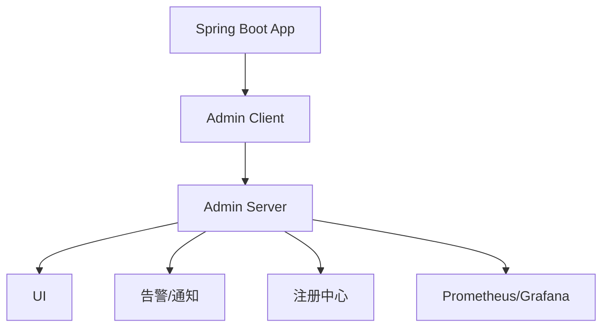
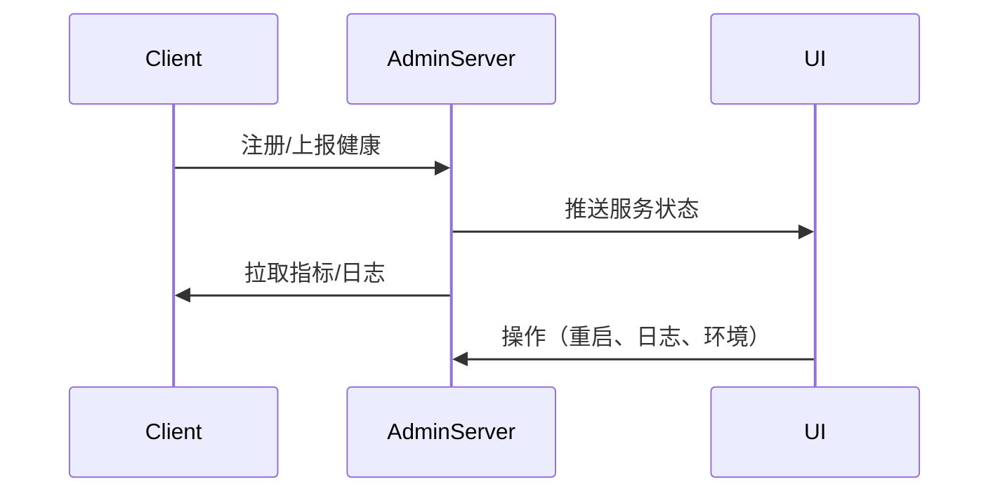

/**
 * Spring Boot Admin 详解
 * @description Spring Boot Admin架构与生态全景，服务注册、健康检查、监控、告警、UI、服务端与客户端配置、源码、集群高可用、告警通知、安全机制、与Spring Boot/Cloud/K8s/Prometheus集成、生产运维、最佳实践与FAQ，极致细化，适合架构师与高级开发者
 */

# Spring Boot Admin 详解

---

## 1. Spring Boot Admin架构与生态全景

### 1.1 监控与可观测性场景
- 实时监控Spring Boot应用健康、指标、日志、JVM、线程、环境
- 支持服务注册、自动发现、分布式监控、告警通知

### 1.2 生态组件
- Admin Server（服务端）、Admin Client（客户端）
- 支持Eureka/Nacos/Consul等注册中心
- 集成Actuator、Prometheus、Grafana、K8s

### 1.3 架构图


---

## 2. 核心原理与源码极致细化

### 2.1 服务注册与健康检查
- 客户端自动注册到Admin Server，定期上报健康、指标、端点
- 支持Eureka/Nacos/Consul自动发现
- 健康检查：/actuator/health、/actuator/info

### 2.2 监控与告警
- 指标采集：/actuator/metrics、/actuator/logfile、/actuator/env
- 告警：状态变更、服务下线、异常、阈值超限

### 2.3 UI与交互
- 实时展示服务状态、指标、日志、JVM、线程、环境
- 支持自定义视图、扩展插件

### 2.4 源码与时序图

- 核心源码：ApplicationRegistry、StatusUpdater、Notifier、AdminServerUiAutoConfiguration

---

## 3. Admin Server配置、源码、集群极致细化

### 3.1 服务端配置
- spring-boot-admin-starter-server、application.yml
- 支持Eureka/Nacos/Consul注册中心
- 端点暴露：management.endpoints.web.exposure.include=*

### 3.2 源码与扩展
- ApplicationRegistry、StatusUpdater、Notifier、Endpoint
- 支持自定义Notifier、UI扩展、认证授权

### 3.3 集群高可用
- 多节点部署、注册中心同步、状态一致性
- K8s部署、负载均衡、健康检查

---

## 4. Admin Client集成、自动注册、实战极致细化

### 4.1 客户端集成
- spring-boot-admin-starter-client、application.yml
- 自动注册、健康上报、端点暴露

### 4.2 源码与自动注册
- ApplicationRegistrator、StatusUpdater、ClientProperties

### 4.3 实战案例
```yaml
spring:
  boot:
    admin:
      client:
        url: http://admin-server:8080
        instance:
          prefer-ip: true
management:
  endpoints:
    web:
      exposure:
        include: '*'
```

---

## 5. 健康检查、指标监控、日志、JVM极致细化

### 5.1 健康检查
- /actuator/health、/actuator/info、定制健康指示器

### 5.2 指标监控
- /actuator/metrics、Prometheus集成、Grafana展示

### 5.3 日志、JVM、线程、环境
- /actuator/logfile、/actuator/jolokia、/actuator/env
- 实时查看/下载日志、JVM堆栈、线程快照

---

## 6. 告警通知极致细化

### 6.1 通知原理
- 状态变更、服务下线、异常、阈值超限触发通知
- 支持邮件、钉钉、企业微信、短信、Webhook等

### 6.2 配置与源码
- Notifier接口、MailNotifier、DingTalkNotifier、WebhookNotifier
- 配置：application.yml

### 6.3 实战案例
```yaml
spring:
  boot:
    admin:
      notify:
        mail:
          to: ops@example.com
          from: admin@example.com
          host: smtp.example.com
          username: admin
          password: xxx
        dingding:
          webhook-url: https://oapi.dingtalk.com/robot/send?access_token=xxx
```

---

## 7. 安全机制极致细化

### 7.1 认证与授权
- 支持Basic、JWT、OAuth2、LDAP等
- 配置：spring.security.user、spring.security.oauth2

### 7.2 接口安全、CSRF、CORS
- CSRF防护、CORS跨域、接口加密、签名
- 配置：SecurityFilterChain、CorsFilter

### 7.3 攻防演练与自动化测试
- 未授权访问、接口劫持、CSRF脚本、自动化安全测试

---

## 8. 与Spring Boot/Cloud/K8s/Prometheus集成极致细化

### 8.1 Spring Boot集成
- 自动装配、Actuator端点、健康检查、日志、指标

### 8.2 Spring Cloud集成
- Eureka/Nacos/Consul注册中心、服务发现、全链路监控

### 8.3 K8s/Prometheus/Grafana集成
- K8s部署、服务发现、Prometheus采集、Grafana展示

### 8.4 监控与健康检查
- Actuator端点、Prometheus、告警脚本

---

## 9. 生产环境部署、运维、CI/CD极致细化

### 9.1 Dockerfile/K8s部署YAML
- Dockerfile、k8s-deployment.yaml、健康检查、弹性伸缩

### 9.2 自动化运维与CI/CD
- Jenkinsfile、定时任务、失败告警、日志采集

### 9.3 性能调优
- 连接池、批量采集、缓存、监控

---

## 10. 常见问题与FAQ、面试高频题、最佳实践极致细化

### 10.1 FAQ
- 如何实现服务自动注册与健康监控？
- 如何自定义告警通知？
- 如何与Prometheus/Grafana集成？
- 如何保障接口安全？
- 如何监控日志与JVM？

### 10.2 高频面试题与标准答案
- Q: Spring Boot Admin核心组件？
  A: Admin Server、Admin Client、注册中心、Notifier、UI、Actuator端点等。
- Q: 如何实现服务健康监控？
  A: 客户端自动注册，定期上报/拉取/推送健康、指标、日志、JVM等。
- Q: 如何自定义告警通知？
  A: 实现Notifier接口，配置邮件、钉钉、Webhook等。
- Q: 如何与Spring Cloud/K8s/Prometheus集成？
  A: 注册中心服务发现、Prometheus采集、K8s部署、Grafana展示。

### 10.3 最佳实践
- Server/Client/Notifier/安全分层设计
- 统一异常处理与告警
- 生产环境安全基线与自动化测试
- 自动化监控与运维

---

> 本文档已极致细化 Spring Boot Admin 全部核心与进阶知识点，适合企业级监控运维架构设计、攻防实战与面试深度准备。 