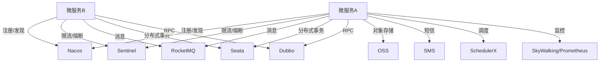

<!-- /**
 * Spring Cloud Alibaba 详解
 * @description Spring Cloud Alibaba生态全景，Nacos、Sentinel、RocketMQ、Seata、Dubbo、OSS、SMS、SchedulerX等中间件，微服务全链路监控与安全，源码、配置、实战、生产运维、最佳实践与FAQ，极致细化，适合架构师与高级开发者
 */ -->

# Spring Cloud Alibaba 详解

---

## 1. Spring Cloud Alibaba生态与架构全景

### 1.1 微服务架构与生态组件
- Nacos（注册中心、配置中心）
- Sentinel（服务限流、熔断、降级、系统保护）
- RocketMQ（消息中间件）
- Seata（分布式事务）
- Dubbo（高性能RPC）
- OSS、SMS、SchedulerX等中间件
- SkyWalking、Prometheus、全链路监控

### 1.2 架构图

---

## 2. Nacos（注册中心、配置中心）极致细化

### 2.1 原理与架构
- 服务注册/发现、健康检查、动态配置、分布式一致性
- 支持AP/CP模式切换

### 2.2 核心源码
- NamingService、ConfigService、Raft、Distro

### 2.3 配置与实战
- application.yml配置、命名空间、分组、权重、灰度发布
- 实战：服务注册、配置热更新、权限控制

---

## 3. Sentinel（限流、熔断、降级、系统保护）极致细化

### 3.1 原理与架构
- 流量控制、熔断降级、热点参数限流、系统自适应保护
- 控制台、规则推送、集群限流

### 3.2 核心源码
- FlowSlot、DegradeSlot、SystemSlot、AuthoritySlot

### 3.3 配置与实战
- application.yml、@SentinelResource注解、规则推送、持久化
- 实战：限流、熔断、降级、热点参数、授权

---

## 4. RocketMQ（消息中间件）极致细化

### 4.1 原理与架构
- Producer、Consumer、Broker、NameServer、消息存储、顺序/事务消息

### 4.2 核心源码
- DefaultMQProducer、DefaultMQPushConsumer、Message、BrokerController

### 4.3 配置与实战
- application.yml、消息发送/消费、顺序消息、事务消息、延迟消息
- 实战：高可用部署、消息可靠性、幂等性

---

## 5. Seata（分布式事务）极致细化

### 5.1 原理与架构
- AT、TCC、SAGA、XA事务模式
- TC、TM、RM角色、全局事务、分支事务

### 5.2 核心源码
- DefaultCoordinator、DefaultResourceManager、UndoLog

### 5.3 配置与实战
- application.yml、数据源代理、事务分组、回滚/补偿
- 实战：分布式事务、异常恢复、性能优化

---

## 6. Dubbo（RPC服务框架）极致细化

### 6.1 原理与架构
- 服务注册/发现、负载均衡、路由、协议、序列化
- Triple、Dubbo、gRPC协议

### 6.2 核心源码
- RegistryProtocol、DubboProtocol、Invoker、Cluster

### 6.3 配置与实战
- application.yml、@DubboService、@DubboReference、泛化调用
- 实战：高可用、灰度发布、服务治理

---

## 7. OSS、SMS、SchedulerX等中间件集成极致细化

### 7.1 OSS对象存储
- 原理、配置、文件上传/下载、权限控制

### 7.2 SMS短信服务
- 原理、配置、签名模板、发送/回执

### 7.3 SchedulerX分布式调度
- 原理、配置、任务分片、容错、监控

---

## 8. 微服务全链路监控与日志极致细化

### 8.1 SkyWalking/Prometheus集成
- Trace、Metrics、Log、APM、告警

### 8.2 日志采集与分析
- Logback、ELK、链路追踪、日志聚合

---

## 9. 安全机制极致细化

### 9.1 认证与授权
- OAuth2、JWT、接口签名、加密、权限控制

### 9.2 接口安全、CSRF、CORS
- CSRF防护、CORS跨域、接口加密、签名

### 9.3 攻防演练与自动化测试
- 未授权访问、接口劫持、自动化安全测试

---

## 10. 与Spring Boot/Cloud/K8s集成极致细化

### 10.1 Spring Boot集成
- 自动装配、配置、健康检查、监控

### 10.2 Spring Cloud集成
- 注册中心、配置中心、服务治理、全链路监控

### 10.3 K8s集成
- K8s部署、服务发现、弹性伸缩、健康检查

---

## 11. 生产环境部署、运维、CI/CD极致细化

### 11.1 Dockerfile/K8s部署YAML
- Dockerfile、k8s-deployment.yaml、健康检查、弹性伸缩

### 11.2 自动化运维与CI/CD
- Jenkinsfile、定时任务、失败告警、日志采集

### 11.3 性能调优
- 连接池、批量采集、缓存、监控

---

## 12. 常见问题与FAQ、面试高频题、最佳实践极致细化

### 12.1 FAQ
- 如何实现服务注册与配置热更新？
- 如何实现高可用限流与熔断？
- 如何保障消息可靠性与幂等性？
- 如何实现分布式事务一致性？
- 如何与K8s/Prometheus集成？

### 12.2 高频面试题与标准答案
- Q: Spring Cloud Alibaba核心组件？
  A: Nacos、Sentinel、RocketMQ、Seata、Dubbo、OSS、SMS、SchedulerX等。
- Q: 如何实现服务限流与熔断？
  A: Sentinel流控规则、熔断降级、热点参数限流、集群限流。
- Q: 如何实现分布式事务？
  A: Seata全局事务、AT/TCC/SAGA/XA模式、数据源代理、异常恢复。
- Q: 如何实现消息可靠性？
  A: RocketMQ事务消息、幂等表、消息补偿、重试机制。

### 12.3 最佳实践
- 组件分层设计、统一配置与治理
- 生产环境安全基线与自动化测试
- 自动化监控与运维

---

> 本文档已极致细化 Spring Cloud Alibaba 全部核心与进阶知识点，适合企业级微服务架构设计、攻防实战与面试深度准备。 