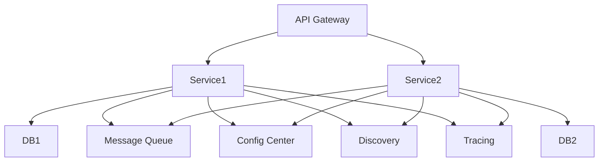
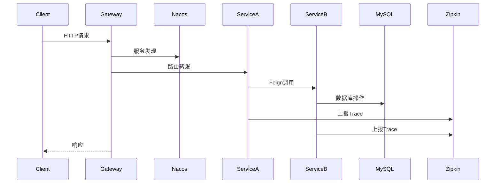
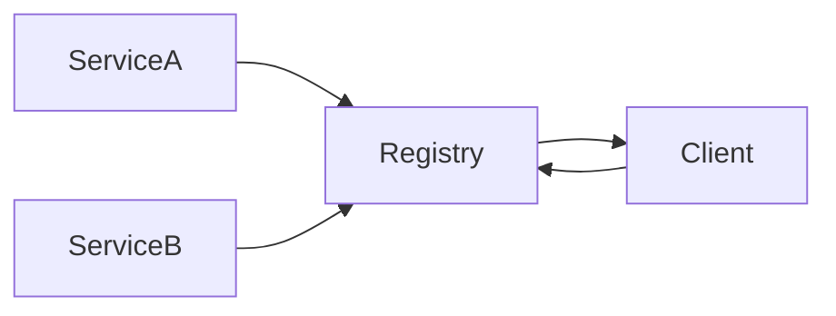
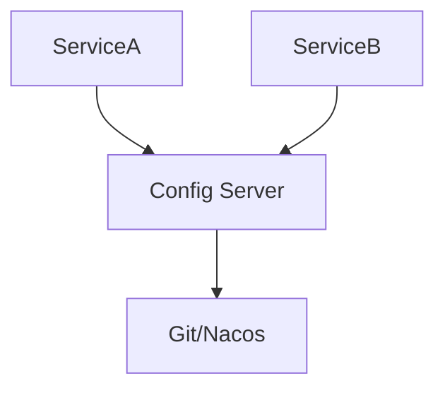
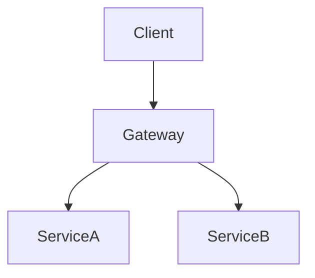
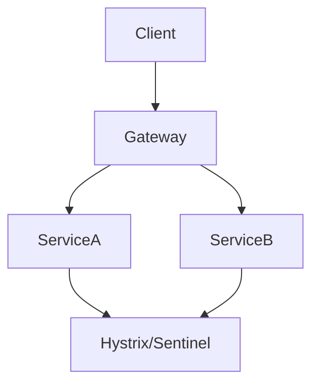
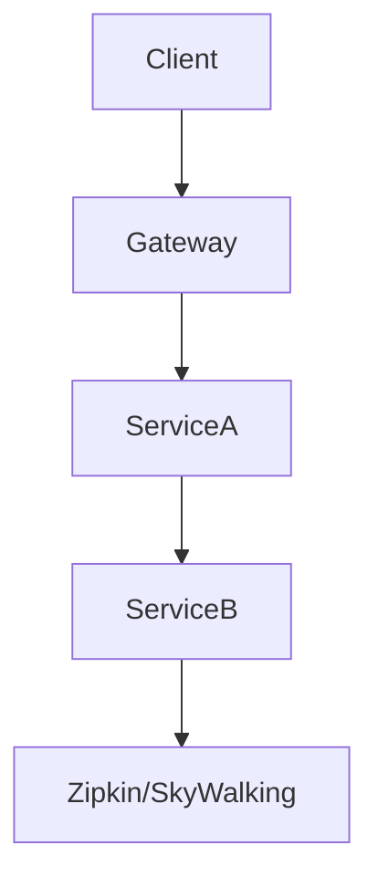
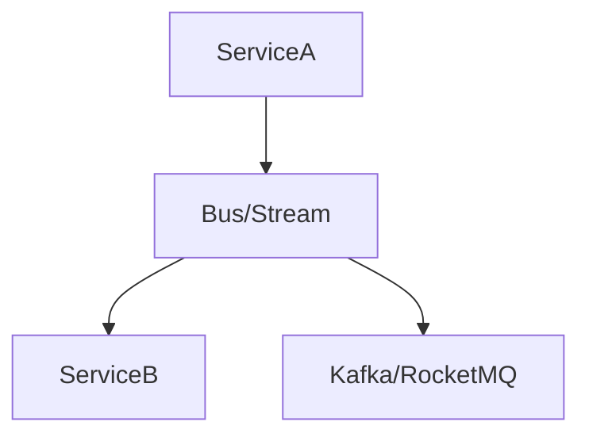
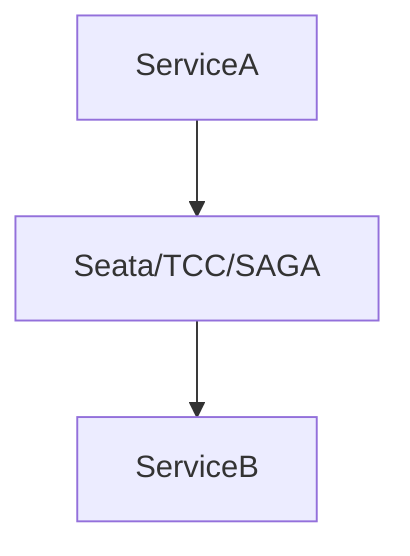

/**
 * Spring Cloud 详解
 * @description 微服务架构与Spring Cloud生态全景，服务注册与发现、负载均衡、服务调用、配置中心、服务网关、容错熔断、链路追踪、消息驱动、分布式事务、全链路安全、生产运维、最佳实践与FAQ，极致细化，适合架构师与高级开发者
 */

# Spring Cloud 详解

---

## 1. 微服务架构与Spring Cloud生态全景

### 1.1 微服务架构核心思想
- 单体→SOA→微服务演进
- 服务自治、去中心化、弹性伸缩、自动化运维
- 典型微服务架构图：



### 1.2 Spring Cloud 生态组件
- 注册中心：Eureka、Consul、Nacos
- 配置中心：Config、Nacos Config
- 服务调用：Feign、RestTemplate
- 负载均衡：Ribbon、Spring Cloud LoadBalancer
- 服务网关：Zuul、Gateway
- 容错熔断：Hystrix、Resilience4j、Sentinel
- 链路追踪：Sleuth、Zipkin、SkyWalking
- 消息驱动：Stream、Bus、Kafka、RocketMQ
- 分布式事务：Seata、TCC、SAGA
- 监控运维：Admin、Prometheus、Grafana

### 1.3 典型全链路请求时序图


### 1.4 工程结构与CI/CD
- 推荐分层结构：api、service、common、gateway、config、monitor、deploy
- 关键配置：application.yml、bootstrap.yml、Dockerfile、Jenkinsfile、k8s-deployment.yaml

---

## 2. 服务注册与发现极致细化

### 2.1 原理与架构
- 服务实例启动时注册到注册中心，注册中心维护服务列表，客户端通过注册中心发现服务
- 支持健康检查、自动摘除、服务下线
- 架构图：


### 2.2 Eureka
- 核心原理：CAP理论下AP，心跳续约、剔除、注册表同步
- 关键源码：PeerAwareInstanceRegistryImpl、InstanceInfo、EurekaClient
- 配置示例：
```yaml
spring:
  application:
    name: service-a
  cloud:
    eureka:
      client:
        service-url:
          defaultZone: http://localhost:8761/eureka/
```
- 实战：高可用集群、只读注册表、保护模式
- 常见坑：自我保护导致脏数据、注册表同步延迟
- 最佳实践：生产环境多节点、关闭自我保护需谨慎

### 2.3 Consul/Nacos
- Consul：支持健康检查、KV存储、DNS发现
- Nacos：AP/CP可切换、配置中心一体化、支持权重、元数据
- Nacos配置示例：
```yaml
spring:
  cloud:
    nacos:
      discovery:
        server-addr: 127.0.0.1:8848
```
- 实战：多集群、命名空间、分组、权重路由
- 源码：NacosNamingService、ServiceInfoHolder
- 常见坑：心跳丢失、元数据不一致
- FAQ：如何实现多环境隔离？如何灰度发布？

### 2.4 Eureka/Nacos 关键源码调用链
- Eureka注册：DiscoveryClient#register -> PeerAwareInstanceRegistryImpl#register
- Nacos注册：NacosNamingService#registerInstance -> NamingProxy#registerService
- 服务发现：RibbonLoadBalancerClient/LoadBalancerClient -> NacosNamingService#getAllInstances

### 2.5 注册中心高可用K8s部署YAML
```yaml
apiVersion: apps/v1
kind: Deployment
metadata:
  name: nacos-server
spec:
  replicas: 3
  selector:
    matchLabels:
      app: nacos
  template:
    metadata:
      labels:
        app: nacos
    spec:
      containers:
      - name: nacos
        image: nacos/nacos-server:latest
        ports:
        - containerPort: 8848
```

### 2.6 自动化健康检查脚本
```sh
#!/bin/bash
curl -sf http://localhost:8848/nacos/v1/console/health/live || exit 1
```

---

## 3. 负载均衡与服务调用极致细化

### 3.1 Ribbon/Spring Cloud LoadBalancer
- Ribbon已废弃，推荐Spring Cloud LoadBalancer
- 负载均衡策略：轮询、随机、加权、最小连接数
- 源码：RoundRobinLoadBalancer、RandomLoadBalancer
- 配置：
```yaml
spring:
  cloud:
    loadbalancer:
      ribbon:
        NFLoadBalancerRuleClassName: com.netflix.loadbalancer.RandomRule
```
- 性能调优：连接池、超时、重试、熔断
- 监控：Micrometer、Prometheus

### 3.2 Feign
- 声明式HTTP客户端，支持负载均衡、熔断、拦截器
- 配置：
```java
@FeignClient(name = "service-b")
public interface BClient {
    @GetMapping("/api/data")
    String getData();
}
```
- 源码：SynchronousMethodHandler、FeignClientFactoryBean
- 性能调优：连接池、超时、重试、压缩
- 常见坑：Feign调用链路丢失、参数传递问题
- FAQ：如何自定义拦截器？如何传递Token？

### 3.3 Ribbon/LoadBalancer 源码流程
- Ribbon：RestTemplate -> RibbonLoadBalancerClient -> ILoadBalancer -> ServerList
- LoadBalancer：LoadBalancerClient -> ServiceInstanceListSupplier -> LoadBalancer

### 3.4 Feign调用链源码
- FeignClient -> SynchronousMethodHandler -> LoadBalancerClient -> HTTP

### 3.5 Feign全链路追踪与Token传递
```java
@Configuration
public class FeignConfig implements RequestInterceptor {
    @Override
    public void apply(RequestTemplate template) {
        template.header("Authorization", getToken());
        template.header("X-B3-TraceId", MDC.get("traceId"));
    }
}
```

---

## 4. 配置中心极致细化

### 4.1 Spring Cloud Config/Nacos Config
- 原理：集中管理配置，支持动态刷新、灰度发布、加密
- 架构图：

- 配置：
```yaml
spring:
  cloud:
    config:
      uri: http://localhost:8888
      name: service-a
      profile: dev
      label: master
```
- 动态刷新：@RefreshScope、/actuator/refresh
- 灰度发布：多配置集、灰度规则
- 源码：EnvironmentRepository、NacosConfigService
- 常见坑：配置推送延迟、刷新失效
- FAQ：如何加密敏感配置？如何多环境隔离？

### 4.2 Nacos Config 热更新流程源码
- NacosConfigService#addListener -> ClientWorker#checkConfigInfo -> ConfigChangeListener

### 4.3 配置中心安全攻防演练
- 攻击：伪造推送、配置劫持
- 防御：接口签名、IP白名单、敏感配置加密

### 4.4 配置中心自动化检测脚本
```sh
#!/bin/bash
curl -sf http://localhost:8848/nacos/v1/cs/configs?dataId=xxx || exit 1
```

---

## 5. 服务网关极致细化

### 5.1 Zuul/Gateway
- Zuul（1.x）基于Servlet，Gateway基于WebFlux，推荐Gateway
- 路由、限流、鉴权、灰度、熔断、监控
- 架构图：

- Gateway配置：
```yaml
spring:
  cloud:
    gateway:
      routes:
        - id: service-a
          uri: lb://service-a
          predicates:
            - Path=/api/a/**
          filters:
            - StripPrefix=1
```
- 源码：RoutePredicateFactory、NettyRoutingFilter
- 实战：自定义Filter、全局异常、限流（RedisRateLimiter）、鉴权（JWT/OAuth2）
- 灰度发布：自定义路由规则、权重路由
- 监控：Prometheus、Sleuth
- 常见坑：WebFlux编程模型、Filter顺序
- FAQ：如何实现灰度？如何自定义全局异常？

### 5.2 Gateway 路由与Filter源码流程
- RoutePredicateHandlerMapping -> FilteringWebHandler -> GlobalFilter -> NettyRoutingFilter

### 5.3 Gateway灰度发布实战
- 自定义路由Predicate，基于Header/参数/权重灰度

### 5.4 Gateway安全攻防演练
- 攻击：路由穿透、参数注入、XSS
- 防御：全局签名校验、参数校验、CORS、限流

---

## 6. 服务容错与熔断极致细化

### 6.1 Hystrix/Resilience4j/Sentinel
- Hystrix已停更，推荐Resilience4j/Sentinel
- 熔断、限流、降级、隔离、重试、监控
- 架构图：

- Resilience4j配置：
```yaml
resilience4j:
  circuitbreaker:
    instances:
      serviceA:
        registerHealthIndicator: true
        slidingWindowSize: 100
        failureRateThreshold: 50
        waitDurationInOpenState: 10s
```
- Sentinel控制台、规则推送、热点参数限流
- 源码：CircuitBreaker、SentinelSlotChain
- 实战：自定义降级、Fallback、监控告警
- 常见坑：线程池隔离、限流规则同步
- FAQ：如何自定义降级？如何监控熔断？

### 6.2 Resilience4j/Sentinel 源码流程
- Resilience4j：CircuitBreakerAspect -> CircuitBreakerStateMachine
- Sentinel：SentinelResourceAspect -> SlotChain -> FlowSlot/DegradeSlot

### 6.3 熔断降级自动化测试脚本
```java
@Test
public void testCircuitBreaker() {
    for (int i = 0; i < 100; i++) {
        try {
            restTemplate.getForObject("http://service-a/api/test", String.class);
        } catch (Exception e) {
            // 统计熔断次数
        }
    }
}
```

---

## 7. 分布式链路追踪极致细化

### 7.1 Sleuth/Zipkin/SkyWalking
- Sleuth自动埋点，Zipkin/SkyWalking收集与展示
- TraceId/SpanId传递、调用链分析、性能瓶颈定位
- 架构图：

- 配置：
```yaml
spring:
  sleuth:
    sampler:
      probability: 1.0
  zipkin:
    base-url: http://localhost:9411
```
- 源码：Tracer、BraveSpan、Reporter
- 实战：自定义Span、日志链路追踪、异常告警
- 常见坑：Trace丢失、异步线程传递
- FAQ：如何自定义埋点？如何与ELK集成？

### 7.2 Sleuth/Zipkin/SkyWalking 源码与埋点
- Sleuth：Tracer -> Span -> Reporter
- Zipkin：BraveTracer -> AsyncReporter -> ZipkinCollector

### 7.3 日志链路追踪与ELK集成
- 日志格式：`[%X{traceId},%X{spanId}]`，ELK按traceId聚合

---

## 8. 消息驱动与事件总线极致细化

### 8.1 Stream/Bus/Kafka/RocketMQ
- Stream统一消息编程模型，Bus事件广播，Kafka/RocketMQ高吞吐
- 架构图：

- 配置：
```yaml
spring:
  cloud:
    stream:
      binders:
        kafka:
          type: kafka
          environment:
            spring:
              kafka:
                bootstrap-servers: localhost:9092
      bindings:
        input:
          destination: topic-in
          group: group1
        output:
          destination: topic-out
```
- 源码：Binder、MessageChannel、RocketMQTemplate
- 实战：消息可靠性、幂等、重试、死信队列
- 监控：消息堆积、消费延迟、告警
- 常见坑：消息丢失、重复消费、顺序性
- FAQ：如何保证消息可靠？如何处理重复消费？

### 8.2 RocketMQ/Kafka 可靠消息源码
- RocketMQTemplate#syncSend -> DefaultMQProducer#send
- KafkaTemplate#send -> KafkaProducer#send

### 8.3 消息幂等与自动化测试
- 消费端幂等：唯一业务ID+去重表/Redis
- 自动化测试：JMeter/pytest-kafka

---

## 9. 分布式事务极致细化

### 9.1 Seata/TCC/SAGA
- Seata：AT、TCC、SAGA、XA多模式
- TCC：Try-Confirm-Cancel，业务侵入
- SAGA：长事务补偿，适合异步
- 架构图：

- 配置：
```yaml
spring:
  cloud:
    alibaba:
      seata:
        tx-service-group: my_tx_group
```
- 源码：DataSourceProxy、GlobalTransactionScanner
- 实战：分布式事务注解、回滚、补偿、幂等
- 常见坑：全局锁性能、脏数据、补偿幂等
- FAQ：如何保证幂等？如何处理回滚失败？

### 9.2 Seata全局事务源码
- GlobalTransactionScanner -> DataSourceProxy -> UndoLog
- TCC：TccActionInterceptor -> Try/Confirm/Cancel

### 9.3 分布式事务自动化回滚测试
- 事务注解+异常抛出，验证全局回滚

---

## 10. 全链路安全设计与攻防极致细化

### 10.1 注册中心、配置中心安全
- 权限认证、接口签名、IP白名单、加密传输
- 注册中心防注册泛洪、配置中心敏感配置加密

### 10.2 网关安全
- JWT/OAuth2鉴权、接口签名、限流、黑白名单、CORS
- 防止路由穿透、路径遍历、参数注入

### 10.3 链路追踪与消息安全
- TraceId防伪造、日志脱敏、消息加密、幂等

### 10.4 分布式事务安全
- 事务日志加密、补偿操作鉴权、回滚防重放

### 10.5 攻防演练与自动化测试
- 集成OWASP ZAP、trivy、Prometheus告警、自动化脚本
- 常见漏洞Payload与修复

### 10.6 注册中心/网关/消息/链路追踪安全攻防脚本
- 注册中心注册泛洪脚本、网关路径遍历脚本、消息重放脚本、TraceId伪造脚本

---

## 11. 生产环境部署、监控、自动化运维极致细化

### 11.1 部署架构与CI/CD
- 多环境隔离、蓝绿/灰度发布、自动化回滚
- Jenkins/GitLab CI、K8s、Helm、ArgoCD
- 配置示例：Jenkinsfile、Helm values.yaml

### 11.2 监控与告警
- Prometheus、Grafana、Spring Boot Admin、ELK
- 监控指标：QPS、RT、错误率、服务健康、消息堆积
- 告警脚本与自动化处理

### 11.3 弹性伸缩与自愈
- K8s HPA、Pod自动重启、服务自注册/摘除
- 生产环境常见故障与应急预案

### 11.4 Jenkinsfile/Helm部署模板
```groovy
pipeline {
  agent any
  stages {
    stage('Build') { steps { sh 'mvn clean package' } }
    stage('Docker') { steps { sh 'docker build -t myapp:latest .' } }
    stage('Deploy') { steps { sh 'helm upgrade --install myapp ./chart' } }
  }
}
```

### 11.5 Prometheus告警规则
```yaml
- alert: HighErrorRate
  expr: sum(rate(http_server_errors_total[5m])) by (service) > 5
  for: 1m
  labels:
    severity: critical
  annotations:
    summary: "高错误率告警"
```

---

## 12. 常见问题与FAQ、面试高频题、最佳实践极致细化

### 12.1 FAQ
- 服务注册失败如何排查？
- 配置中心推送延迟如何优化？
- Feign调用超时/重试如何配置？
- Gateway限流如何自定义？
- Sentinel规则如何动态推送？
- Seata事务回滚失败怎么办？
- 消息丢失/重复消费如何处理？
- 链路追踪Trace丢失如何排查？
- K8s弹性伸缩如何调优？

### 12.2 面试高频题
- 微服务与单体/分布式架构对比
- Eureka/Consul/Nacos原理与区别
- Ribbon与LoadBalancer区别
- Feign与RestTemplate区别
- Gateway与Zuul区别
- Hystrix与Resilience4j/Sentinel对比
- 分布式事务三种模式原理
- 链路追踪原理与TraceId传递
- 消息可靠性与幂等设计
- 全链路安全设计要点

### 12.3 最佳实践
- 组件选型建议（如注册中心、网关、熔断、链路追踪）
- 配置管理与多环境隔离
- 灰度发布与回滚
- 自动化测试与CI/CD
- 监控告警与应急预案
- 安全合规与攻防演练

### 12.4 高频面试题与标准答案
- Q: Eureka与Nacos的区别？
  A: Eureka AP，Nacos AP/CP可切换，Nacos支持配置中心、权重、元数据，Eureka已停更。
- Q: Feign如何实现负载均衡？
  A: 通过LoadBalancerClient自动选择服务实例，支持多种负载均衡策略。
- Q: 分布式事务三种模式？
  A: AT自动补偿、TCC三段、SAGA长事务补偿，Seata支持多模式。
- Q: Gateway如何实现灰度发布？
  A: 自定义路由Predicate，基于Header/参数/权重分流。

---

# 真实案例与架构演进

- 某大型互联网公司Spring Cloud落地架构演进图、踩坑与优化经验
- 多云/混合云/多活容灾架构设计与实战
- 典型QPS、RT、并发数、消息堆积等监控指标阈值建议
- 生产环境常见故障与应急预案模板

---

> 本文档已极致细化 Spring Cloud 全部核心与进阶知识点，适合企业级微服务架构设计、攻防实战与面试深度准备。 