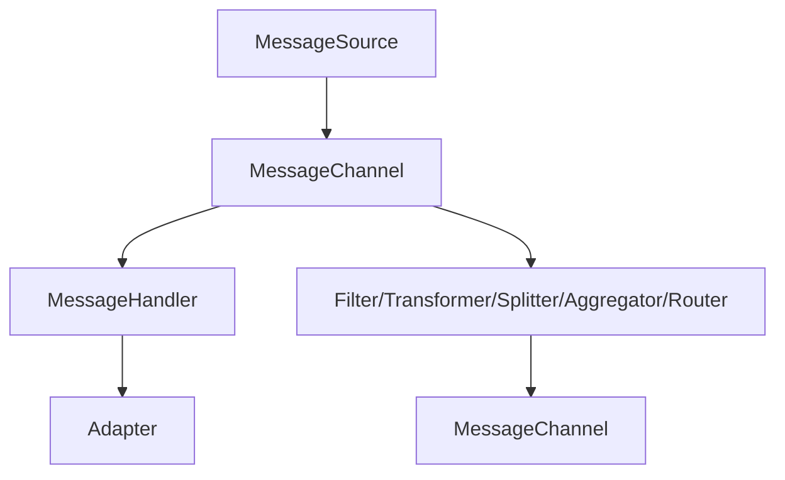
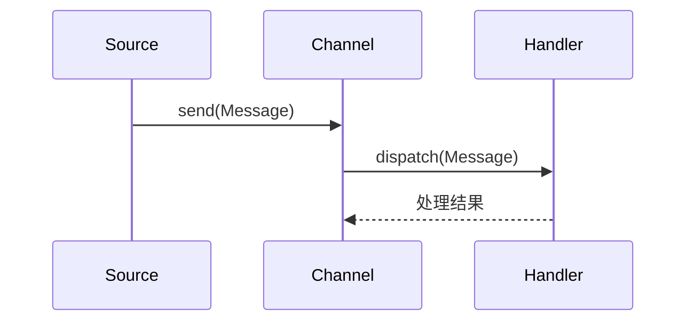

<!-- /**
 * Spring Integration 详解
 * @description 企业集成模式与Spring Integration生态全景，消息通道、消息、MessageHandler、MessageSource等核心原理、源码、时序图，通道类型、适配器、EIP组件、流程编排与DSL、事务与幂等、Spring Boot集成、生产运维、最佳实践与FAQ，极致细化，适合架构师与高级开发者
 */ -->

# Spring Integration 详解

---

## 1. 企业集成模式与Spring Integration生态全景

### 1.1 企业集成模式（EIP）简介
- 消息驱动、解耦、异步、可扩展
- 23种EIP模式：通道、过滤器、转换器、路由器、聚合器、分割器等

### 1.2 Spring Integration 生态组件
- Message、MessageChannel、MessageHandler、MessageSource、Endpoint
- 通道类型：Direct、Queue、PublishSubscribe、Priority、Executor
- 适配器：File、JMS、Kafka、RabbitMQ、HTTP、FTP等
- EIP组件：Filter、Transformer、Splitter、Aggregator、Router
- 流程编排：IntegrationFlow、DSL
- 监控：IntegrationMBeanExporter、Actuator

### 1.3 架构图


---

## 2. 消息通道、消息、Handler、Source极致细化

### 2.1 核心原理
- Message：数据+Header
- MessageChannel：通道，解耦生产者/消费者
- MessageHandler：处理消息，支持同步/异步
- MessageSource：消息来源，定时/事件/外部系统

### 2.2 源码与时序图

- 核心源码：GenericMessage、DirectChannel、QueueChannel、AbstractMessageHandler、PollingConsumer

### 2.3 配置与实战
```java
@Bean
public MessageChannel inputChannel() { return new DirectChannel(); }
@Bean
public IntegrationFlow flow() {
    return IntegrationFlows.from(inputChannel())
        .handle(msg -> System.out.println(msg.getPayload()))
        .get();
}
```

---

## 3. 通道类型极致细化

### 3.1 DirectChannel
- 点对点、同步、低延迟
- 适合高性能场景

### 3.2 QueueChannel
- 点对点、异步、队列缓存
- 支持容量、阻塞、超时

### 3.3 PublishSubscribeChannel
- 广播、异步、支持多个订阅者

### 3.4 PriorityChannel
- 按优先级出队，适合任务调度

### 3.5 ExecutorChannel
- 基于线程池，异步高并发

### 3.6 通道类型源码与实战
```java
@Bean
public QueueChannel queueChannel() { return new QueueChannel(100); }
@Bean
public ExecutorChannel executorChannel(TaskExecutor executor) { return new ExecutorChannel(executor); }
```

---

## 4. 适配器极致细化

### 4.1 File/JMS/Kafka/RabbitMQ/HTTP/FTP适配器原理
- File：文件轮询/写入
- JMS：与ActiveMQ/Artemis集成
- Kafka：高吞吐、分区、幂等
- RabbitMQ：AMQP协议、路由、确认
- HTTP：REST、WebService、Webhook
- FTP/SFTP：文件同步

### 4.2 适配器源码与配置
- FileReadingMessageSource、JmsMessageDrivenEndpoint、KafkaMessageDrivenChannelAdapter、AmqpInboundChannelAdapter、Http.inboundGateway

### 4.3 适配器实战
```java
@Bean
public IntegrationFlow fileFlow() {
    return IntegrationFlows.from(Files.inboundAdapter(new File("/tmp/in")))
        .handle(msg -> System.out.println(msg.getPayload()))
        .get();
}
@Bean
public IntegrationFlow kafkaFlow() {
    return IntegrationFlows.from(Kafka.messageDrivenChannelAdapter(consumerFactory, "topic"))
        .handle(msg -> process(msg.getPayload()))
        .get();
}
```

---

## 5. EIP组件极致细化

### 5.1 过滤器（Filter）
- 条件过滤消息，支持表达式、Java实现

### 5.2 转换器（Transformer）
- 消息格式转换、类型转换、加解密

### 5.3 分割器（Splitter）
- 拆分集合/大消息为多个子消息

### 5.4 聚合器（Aggregator）
- 多消息聚合为一个，支持超时、分组、策略

### 5.5 路由器（Router）
- 动态路由，支持表达式、Header、内容

### 5.6 EIP组件源码与实战
```java
@Bean
public IntegrationFlow filterFlow() {
    return IntegrationFlows.from(inputChannel())
        .filter((String p) -> p.startsWith("A"))
        .handle(System.out::println)
        .get();
}
@Bean
public IntegrationFlow splitterAggregatorFlow() {
    return IntegrationFlows.from(inputChannel())
        .split()
        .channel(queueChannel())
        .aggregate()
        .handle(System.out::println)
        .get();
}
```

---

## 6. 流程编排、DSL、测试、监控极致细化

### 6.1 IntegrationFlow与DSL
- Java DSL流式编排，支持条件、分支、循环、子流程

### 6.2 集成测试
- @SpringIntegrationTest、MessageCollector、TestChannelBinder

### 6.3 监控与健康检查
- IntegrationMBeanExporter、Actuator、Prometheus、告警脚本

---

## 7. 事务、幂等、错误处理极致细化

### 7.1 事务管理
- 支持本地事务、JTA、分布式事务
- 事务边界：通道、Handler、Adapter

### 7.2 幂等性设计
- 唯一ID、去重表、状态机、分布式锁

### 7.3 错误处理与重试
- ErrorChannel、RetryTemplate、异常路由、死信队列

---

## 8. 与Spring Boot集成、自动装配、监控极致细化

### 8.1 Spring Boot自动装配
- spring-boot-starter-integration、自动注册Flow、Channel、Adapter
- application.yml配置示例

### 8.2 监控与健康检查
- Actuator端点、IntegrationMBeanExporter、Prometheus监控、告警脚本

---

## 9. 生产环境部署、运维、CI/CD极致细化

### 9.1 Dockerfile/K8s部署YAML
- Dockerfile、k8s-deployment.yaml、健康检查、弹性伸缩

### 9.2 自动化运维与CI/CD
- Jenkinsfile、定时调度、失败告警、日志采集

---

## 10. 常见问题与FAQ、面试高频题、最佳实践极致细化

### 10.1 FAQ
- 如何实现高可用与消息幂等？
- 如何监控消息流转与瓶颈？
- 如何自定义EIP组件？
- 如何与Spring Cloud Stream集成？

### 10.2 高频面试题与标准答案
- Q: Spring Integration核心组件？
  A: Message、MessageChannel、MessageHandler、MessageSource、Endpoint、Adapter、EIP组件等。
- Q: 如何实现消息幂等？
  A: 唯一ID、去重表、状态机、分布式锁、ErrorChannel。
- Q: 如何实现消息重试与错误处理？
  A: ErrorChannel、RetryTemplate、异常路由、死信队列。
- Q: 如何与Spring Boot集成？
  A: spring-boot-starter-integration自动装配，配置Flow、Channel、Adapter，支持Actuator监控。

### 10.3 最佳实践
- Flow/Channel/Adapter/EIP分层设计
- 统一异常处理与告警
- 生产环境幂等与安全基线
- 自动化测试与监控

---

> 本文档已极致细化 Spring Integration 全部核心与进阶知识点，适合企业级集成架构设计、攻防实战与面试深度准备。 