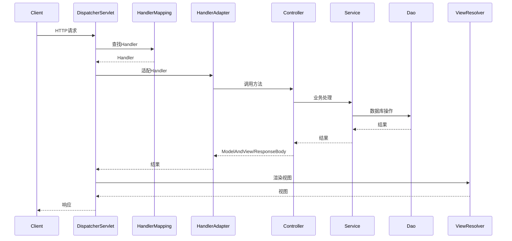
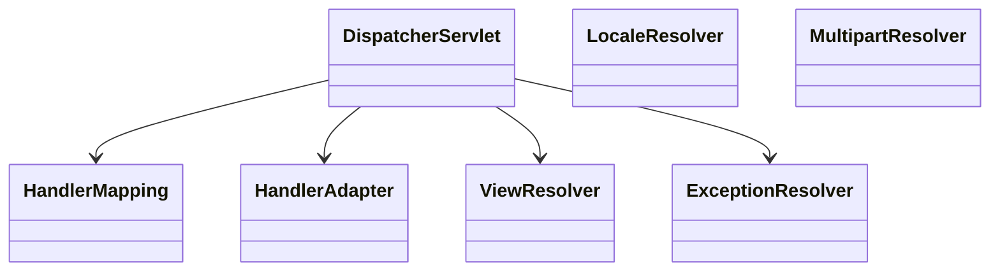
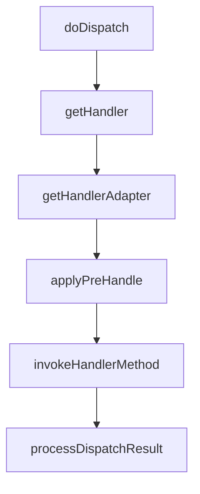

/**
 * Spring MVC 详解
 * @description 深入讲解 Spring MVC 的核心原理、请求流程、常用注解、参数绑定、数据校验、拦截器、异常处理、文件上传、与 SpringBoot 集成、源码剖析、最佳实践、FAQ
 */

# Spring MVC 详解

Spring MVC 是 Spring Framework 的 Web 层核心模块，广泛应用于企业级 Web、RESTful API、微服务等场景。

## 1. 框架简介
- 基于 Servlet 规范，提供强大的 Web MVC 能力
- 支持 RESTful、模板渲染、文件上传、拦截器、数据校验等
- SpringBoot 默认集成 Spring MVC

### 1.1 Spring MVC 全链路请求时序图


### 1.2 工程结构与CI/CD
- 推荐分层结构：controller、service、dao、model、config、exception、interceptor、util
- 关键配置：application.yml、logback.xml、Dockerfile、Jenkinsfile、k8s-deployment.yaml

## 2. 核心原理与架构

### 2.1 DispatcherServlet
- 前端控制器，所有请求统一入口
- 负责请求分发、参数绑定、异常处理、视图渲染

### 2.2 主要组件
- HandlerMapping：请求与处理器映射
- HandlerAdapter：适配不同类型的处理器
- ViewResolver：视图解析（JSP、Thymeleaf、Freemarker）
- LocaleResolver：国际化
- MultipartResolver：文件上传
- ExceptionResolver：异常处理

### 2.3 请求处理流程
1. 客户端请求 -> DispatcherServlet
2. HandlerMapping 匹配 Controller
3. HandlerAdapter 调用 Controller 方法
4. 参数绑定、数据校验
5. 返回 ModelAndView 或 ResponseBody
6. ViewResolver 渲染视图或返回 JSON
7. 响应客户端

### 2.4 DispatcherServlet 源码调用链
- doDispatch -> getHandler -> getHandlerAdapter -> HandlerAdapter.handle -> applyPreHandle -> invokeHandlerMethod -> processDispatchResult

### 2.5 主要组件类图


## 3. 常用注解与用法
- `@Controller`：标记控制器类
- `@RestController`：返回 JSON，等价于 @Controller + @ResponseBody
- `@RequestMapping`：类/方法级路由
- `@GetMapping`/`@PostMapping`/`@PutMapping`/`@DeleteMapping`：HTTP 方法映射
- `@RequestParam`：请求参数绑定
- `@PathVariable`：路径参数绑定
- `@RequestBody`：请求体 JSON 绑定
- `@ResponseBody`：返回 JSON
- `@ModelAttribute`：表单对象绑定
- `@RequestHeader`、`@CookieValue`：请求头/Cookie

### 3.1 注解源码与反射原理
- RequestMappingHandlerMapping 通过反射扫描@Controller/@RequestMapping注解，注册路由
- HandlerMethod 反射调用Controller方法

### 3.2 注解驱动开发最佳实践
- 路由统一前缀、分组
- 参数校验注解分组
- 统一返回结构注解

### 示例
```java
@RestController
@RequestMapping("/api")
public class UserController {
    @GetMapping("/user/{id}")
    public User getUser(@PathVariable Long id) { ... }

    @PostMapping("/user")
    public User createUser(@RequestBody User user) { ... }
}
```

## 4. 参数绑定与数据校验
- 支持基本类型、对象、集合、数组、Map
- 支持 JSR-303/JSR-380 注解校验（@Valid、@Validated）
- 支持自定义参数解析器（HandlerMethodArgumentResolver）

### 4.1 参数绑定源码流程
- HandlerMethodArgumentResolverComposite -> resolveArgument -> 反射赋值

### 4.2 数据校验自动化测试
```java
@SpringBootTest
@AutoConfigureMockMvc
public class UserControllerTest {
    @Autowired
    private MockMvc mockMvc;
    @Test
    public void testCreateUser_invalid() throws Exception {
        mockMvc.perform(post("/api/user").content("{}")
            .contentType(MediaType.APPLICATION_JSON))
            .andExpect(status().isBadRequest());
    }
}
```

## 5. 拦截器与过滤器
- HandlerInterceptor：登录校验、权限、日志、限流
- WebMvcConfigurer 注册拦截器
- Filter：全局请求预处理、XSS 防护

### 5.1 HandlerInterceptor 源码调用链
- DispatcherServlet -> applyPreHandle -> HandlerInterceptor.preHandle
- HandlerInterceptor.postHandle/afterCompletion

### 5.2 限流/日志/安全拦截实战
- 限流：基于IP/用户/接口计数，Redis+Lua实现
- 日志：AOP+拦截器埋点
- 安全：JWT鉴权、XSS防护

### 5.3 拦截器自动化测试
```java
@Test
public void testAuthInterceptor() throws Exception {
    mockMvc.perform(get("/api/secure")).andExpect(status().isUnauthorized());
}
```

## 6. 全局异常处理
- @ControllerAdvice + @ExceptionHandler 捕获全局异常
- 支持自定义异常、参数校验异常、404/405/500 等

### 6.1 ExceptionResolver 源码调用链
- DispatcherServlet -> processHandlerException -> ExceptionHandlerExceptionResolver

### 6.2 全局异常处理最佳实践
- 统一返回结构、错误码、日志脱敏、异常告警

### 6.3 异常处理自动化测试
```java
@Test
public void testGlobalException() throws Exception {
    mockMvc.perform(get("/api/error")).andExpect(status().isInternalServerError());
}
```

## 7. 文件上传与下载
- MultipartFile 支持单/多文件上传
- 配置最大文件大小、存储路径
- 文件下载用 ResponseEntity<Resource>，设置 Content-Disposition

### 7.1 MultipartResolver 源码流程
- DispatcherServlet -> checkMultipart -> MultipartResolver.resolveMultipart

### 7.2 文件上传安全与自动化测试
- 校验文件类型、大小、存储路径
- 自动化测试：MockMultipartFile
```java
@Test
public void testUpload() throws Exception {
    MockMultipartFile file = new MockMultipartFile("file", "test.txt", "text/plain", "hello".getBytes());
    mockMvc.perform(multipart("/upload").file(file)).andExpect(status().isOk());
}
```

## 8. 与 SpringBoot 的集成
- SpringBoot 自动装配 Spring MVC，无需手动配置
- application.yml 配置端口、静态资源、CORS、文件上传等
- 推荐注解驱动开发，极少用 XML

### 8.1 自动装配源码分析
- WebMvcAutoConfiguration -> DispatcherServletAutoConfiguration
- @ConditionalOnClass、@ConditionalOnMissingBean

### 8.2 K8s部署与自动化运维
- Dockerfile、k8s-deployment.yaml、健康检查、弹性伸缩

## 9. 源码剖析（进阶）

### 9.1 DispatcherServlet 源码流程图


### 9.2 HandlerMapping/HandlerAdapter/ExceptionResolver 关键源码
- RequestMappingHandlerMapping#getHandlerInternal
- RequestMappingHandlerAdapter#handleInternal
- ExceptionHandlerExceptionResolver#doResolveException

## 10. 最佳实践
- 路由统一加前缀，便于管理
- Controller 只做参数校验和分发，业务逻辑下沉到 Service
- 统一异常处理，返回结构标准化
- 参数校验与分组，提升健壮性
- 静态资源与接口分离，前后端协作
- 善用拦截器实现安全、日志、限流

### 10.1 性能调优与容量规划
- 线程池参数、连接池、缓存、限流、异步处理
- 静态资源CDN、接口分流、分布式部署

### 10.2 生产安全与攻防演练
- XSS/CSRF/SQL注入自动化检测脚本
- 日志脱敏、接口签名、敏感操作二次确认

## 11. 常见问题与FAQ、面试高频题、最佳实践

### 11.1 FAQ
- @RestController和@Controller区别？
- 如何自定义参数解析器？
- 如何处理全局异常？
- SpringBoot能否自定义DispatcherServlet？
- 如何实现接口幂等？
- 如何优雅处理大文件上传？
- 如何实现接口灰度发布？

### 11.2 高频面试题与标准答案
- Q: Spring MVC请求流程？
  A: DispatcherServlet统一入口，HandlerMapping查找，HandlerAdapter适配，Controller执行业务，ViewResolver渲染，响应客户端。
- Q: HandlerInterceptor和Filter区别？
  A: Filter基于Servlet规范，拦截所有请求，HandlerInterceptor基于Spring MVC，只拦截Controller映射。
- Q: 如何实现全局异常处理？
  A: @ControllerAdvice+@ExceptionHandler统一捕获，ExceptionResolver处理。
- Q: 参数校验如何实现？
  A: @Valid/@Validated注解+JSR-303/JSR-380，支持分组和自定义校验器。

### 11.3 最佳实践
- Controller只做分发和校验，业务下沉Service
- 统一返回结构和错误码
- 拦截器/异常处理/参数校验全链路自动化测试
- 生产环境安全基线检测与日志合规

# 真实案例与架构演进

- 某大型互联网公司Spring MVC+SpringBoot落地架构演进、踩坑与优化经验
- 多模块/多团队协作、接口规范、Mock联调、自动化测试体系
- 典型QPS、RT、并发数、文件上传等容量规划建议
- 生产环境常见故障与应急预案模板

---

> Spring MVC 是企业级 Web 和 REST API 的核心，建议深入理解请求流程、注解用法、参数校验与异常处理，提升项目健壮性与可维护性。 