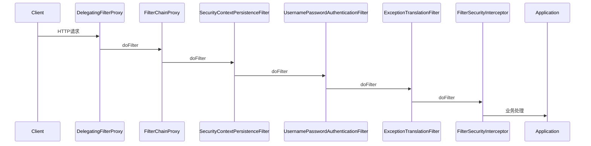
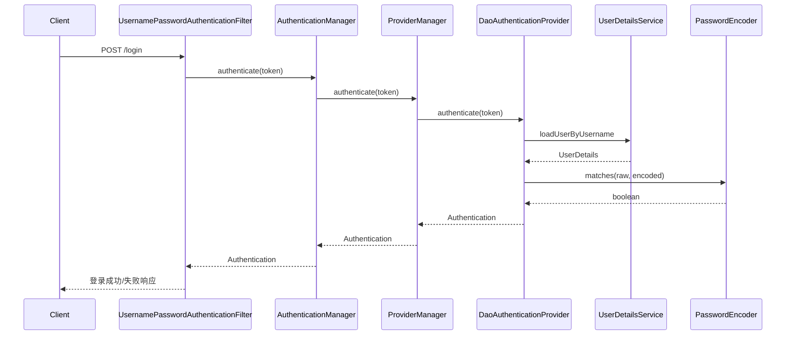
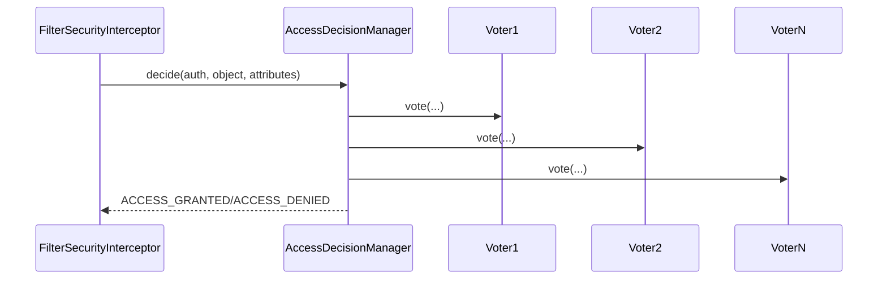
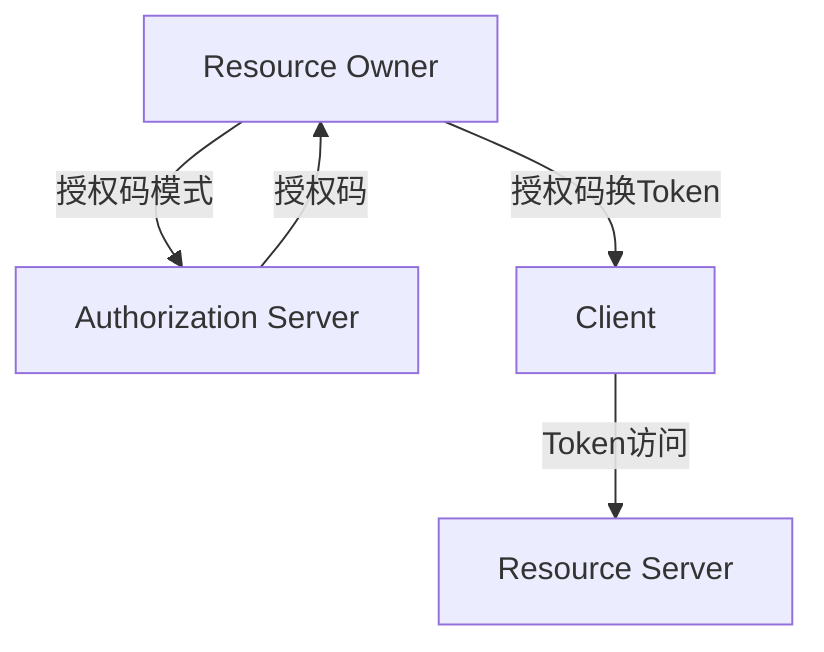
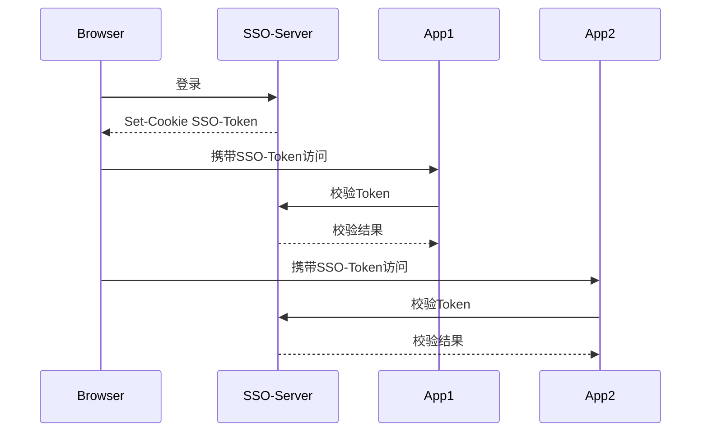

/**
 * Spring Security 详解
 * @description 深入讲解 Spring Security 的核心原理、过滤器链、认证授权、会话管理、注解、配置、用户体系、密码加密、JWT/OAuth2/SSO、方法级安全、RBAC、接口安全、与SpringBoot集成、源码剖析、最佳实践、FAQ
 */

# Spring Security 详解

Spring Security 是 Spring 生态下的安全框架，提供了强大的认证、授权、会话管理、接口安全等能力，适合企业级项目。

## 1. 框架简介
- 基于 Servlet 过滤器链，所有请求都经过安全过滤
- 支持表单登录、HTTP Basic、Token、OAuth2、LDAP、SSO 等多种认证方式
- 与 SpringBoot 无缝集成，自动配置安全策略

## 2. 核心原理

### 2.1 过滤器链（FilterChain）
- SecurityFilterChain 由多个 Filter 组成，按顺序处理请求
- 常见 Filter：UsernamePasswordAuthenticationFilter、BasicAuthenticationFilter、ExceptionTranslationFilter、FilterSecurityInterceptor

### 2.2 认证（Authentication）
- 用户登录时，认证信息封装为 Authentication 对象
- UserDetailsService 加载用户信息，PasswordEncoder 校验密码
- 认证成功后，信息存储在 SecurityContextHolder

### 2.3 授权（Authorization）
- AccessDecisionManager 决策是否有权访问资源
- 支持基于角色（hasRole）、权限（hasAuthority）、表达式（@PreAuthorize）
- 支持 URL、方法、注解多层级授权

### 2.4 会话管理
- 支持 Session、RememberMe、Token（JWT）、分布式会话（Spring Session）
- 支持并发登录控制、会话失效、踢人下线

## 3. 常用注解
- `@EnableWebSecurity`：启用 Web 安全
- `@EnableGlobalMethodSecurity`：启用方法级安全
- `@PreAuthorize`、`@PostAuthorize`、`@Secured`、`@RolesAllowed`：方法/接口权限
- `@WithMockUser`：测试用

## 4. 配置与集成

### 4.1 基本配置
- 继承 WebSecurityConfigurerAdapter（5.7 之前）或配置 SecurityFilterChain（5.7+ 推荐）
- 配置登录页、登出、异常处理、静态资源放行
- 示例：
  ```java
  @Configuration
  public class SecurityConfig {
      @Bean
      public SecurityFilterChain filterChain(HttpSecurity http) throws Exception {
          http
              .authorizeHttpRequests()
                  .antMatchers("/login", "/css/**").permitAll()
                  .anyRequest().authenticated()
              .and()
              .formLogin().loginPage("/login").permitAll()
              .and()
              .logout().permitAll();
          return http.build();
      }
  }
  ```

### 4.2 用户体系与密码加密
- 实现 UserDetailsService，加载用户、角色、权限
- 密码加密推荐 BCryptPasswordEncoder
- 支持自定义用户表、权限表、角色表

### 4.3 JWT、OAuth2、单点登录（SSO）
- JWT 适合前后端分离、移动端、微服务
- OAuth2 支持第三方登录、授权码、客户端模式
- SSO 适合多系统统一认证

### 4.4 方法级安全
- @PreAuthorize("hasRole('ADMIN')")、@Secured({"ROLE_ADMIN"})
- @EnableGlobalMethodSecurity(prePostEnabled = true, securedEnabled = true)

### 4.5 RBAC 权限模型
- 用户-角色-权限三表设计
- 动态权限、菜单、按钮级控制
- 权限缓存、动态刷新

### 4.6 接口安全
- 防止 CSRF、XSS、SQL 注入
- 接口签名、限流、验证码
- 日志审计、异常报警

## 5. 与 SpringBoot 的集成
- SpringBoot 自动装配 Security，application.yml 配置即可
- 支持自定义登录、登出、异常、静态资源放行
- 推荐注解驱动开发，极少用 XML

## 6. 源码剖析（简要）
- SecurityFilterChain：过滤器链核心
- AuthenticationManager、ProviderManager：认证管理
- UserDetailsService、PasswordEncoder：用户与密码
- AccessDecisionManager、Voter：授权决策
- SecurityContextHolder：安全上下文

## 7. 最佳实践
- 密码加密存储，Token 定期刷新
- 静态资源、登录、注册、验证码等接口放行
- 生产环境强制 HTTPS
- 日志不打印敏感信息
- 定期安全扫描与渗透测试
- 依赖库及时升级，修复 CVE

## 8. 常见问题与 FAQ

### Q: 如何自定义登录逻辑？
A: 实现 UserDetailsService，配置自定义登录页和认证流程。

### Q: 如何实现接口权限动态刷新？
A: 权限变更后刷新缓存，Token 失效或强制重新登录。

### Q: 如何防止接口被刷？
A: 配合限流（如 Bucket4j、Sentinel）、验证码、IP 黑名单。

### Q: 如何集成第三方登录？
A: 用 spring-boot-starter-oauth2-client，配置 provider 信息。

## 9. 过滤器链全流程与自定义 Filter 极致细化

### 9.1 过滤器链全流程源码与流程图

#### Mermaid 时序图


#### Filter链源码关键片段
```java
/**
 * FilterChainProxy#doFilterInternal
 * @param request HTTP请求
 * @param response HTTP响应
 * @param chain 原始Filter链
 */
@Override
protected void doFilterInternal(HttpServletRequest request, HttpServletResponse response, FilterChain chain)
        throws IOException, ServletException {
    List<Filter> filters = getFilters(request);
    if (filters == null || filters.isEmpty()) {
        chain.doFilter(request, response);
        return;
    }
    VirtualFilterChain vfc = new VirtualFilterChain(request, chain, filters);
    vfc.doFilter(request, response);
}
```

#### Filter链性能监控与AOP埋点
```java
/**
 * @description 过滤器链性能监控AOP
 */
@Aspect
@Component
public class FilterChainMonitorAspect {
    @Around("execution(* org.springframework.security.web.FilterChainProxy.doFilterInternal(..))")
    public Object monitor(ProceedingJoinPoint pjp) throws Throwable {
        long start = System.currentTimeMillis();
        Object result = pjp.proceed();
        long cost = System.currentTimeMillis() - start;
        log.info("FilterChain执行耗时: {}ms", cost);
        return result;
    }
}
```

#### Filter链单元测试
```java
/**
 * @description 使用MockMvc测试自定义Filter
 */
@SpringBootTest
@AutoConfigureMockMvc
public class FilterTest {
    @Autowired
    private MockMvc mockMvc;

    @Test
    public void testIpBlacklistFilter() throws Exception {
        mockMvc.perform(get("/api/test").with(request -> {
            request.setRemoteAddr("192.168.1.100");
            return request;
        }))
        .andExpect(status().isForbidden());
    }
}
```

#### Filter链常见陷阱
- Filter顺序错误导致认证/授权失效
- 异常未捕获导致敏感信息泄露
- 自定义Filter未继承`OncePerRequestFilter`导致重复执行
- WebFlux异步场景下需用`WebFilter`实现

### 9.2 自定义Filter极致实战

#### 典型场景
- 日志审计
- IP黑白名单
- 接口签名
- 租户隔离
- 行为分析

#### 自定义Filter源码与JSDoc注释
```java
/**
 * @description 自定义接口签名校验Filter
 * @author yourname
 */
public class ApiSignFilter extends OncePerRequestFilter {
    @Override
    protected void doFilterInternal(HttpServletRequest request, HttpServletResponse response, FilterChain filterChain)
            throws ServletException, IOException {
        String sign = request.getHeader("X-Sign");
        String timestamp = request.getHeader("X-Timestamp");
        // 校验签名与时间戳
        if (!SignUtil.verify(request, sign, timestamp)) {
            response.setStatus(HttpServletResponse.SC_UNAUTHORIZED);
            response.getWriter().write("签名校验失败");
            return;
        }
        filterChain.doFilter(request, response);
    }
}
```

#### 注册与顺序
```java
http.addFilterBefore(new ApiSignFilter(), UsernamePasswordAuthenticationFilter.class);
```

#### 性能调优
- 只对敏感接口启用自定义Filter
- Filter内部避免阻塞操作
- 监控Filter耗时，及时告警

#### 监控与告警
- 可用Prometheus+Grafana监控Filter链耗时
- 异常日志自动告警

## 10. 认证流程源码级极致细化

### 10.1 UsernamePasswordAuthenticationFilter源码流程图



#### 源码关键路径
```java
/**
 * UsernamePasswordAuthenticationFilter#attemptAuthentication
 * @param request HTTP请求
 * @param response HTTP响应
 * @return 认证结果Authentication
 */
@Override
public Authentication attemptAuthentication(HttpServletRequest request, HttpServletResponse response)
        throws AuthenticationException {
    String username = obtainUsername(request);
    String password = obtainPassword(request);
    UsernamePasswordAuthenticationToken authRequest = new UsernamePasswordAuthenticationToken(username, password);
    setDetails(request, authRequest);
    return this.getAuthenticationManager().authenticate(authRequest);
}
```

### 10.2 ProviderManager多Provider链路与扩展点

#### 多Provider链路
- 支持多种认证方式（如密码、短信、第三方）
- 遍历所有Provider，遇到支持的即执行

#### 源码片段
```java
/**
 * ProviderManager#authenticate
 */
for (AuthenticationProvider provider : getProviders()) {
    if (provider.supports(authentication.getClass())) {
        result = provider.authenticate(authentication);
        if (result != null) {
            return result;
        }
    }
}
```

#### 自定义多因子认证Provider
```java
/**
 * @description 自定义MFA认证Provider
 */
public class MfaAuthenticationProvider implements AuthenticationProvider {
    @Override
    public Authentication authenticate(Authentication authentication) throws AuthenticationException {
        // 校验用户名密码+动态码
    }
    @Override
    public boolean supports(Class<?> authentication) {
        return MfaAuthenticationToken.class.isAssignableFrom(authentication);
    }
}
```

### 10.3 UserDetailsService与多数据源/多租户

#### 多数据源/多租户动态切换
- 可通过ThreadLocal或AOP动态切换数据源
- 不同租户可用不同UserDetailsService实现

#### 密码加密升级兼容
- 支持多种PasswordEncoder，兼容历史数据
- 推荐BCrypt，升级时可用DelegatingPasswordEncoder

#### 认证流程分布式追踪
- 在认证链路中埋点TraceId，便于问题追踪
- 日志脱敏，避免泄露密码/Token

## 11. 授权流程源码级极致细化

### 11.1 AccessDecisionManager/Voter 源码与流程图

#### Mermaid 流程图


#### AccessDecisionManager 三种实现源码对比
- AffirmativeBased（一票通过）
- ConsensusBased（少数服从多数）
- UnanimousBased（一票否决）

```java
/**
 * AffirmativeBased#decide
 */
for (AccessDecisionVoter voter : getDecisionVoters()) {
    int result = voter.vote(authentication, object, configAttributes);
    if (result == AccessDecisionVoter.ACCESS_GRANTED) {
        return;
    }
}
throw new AccessDeniedException(...);
```

#### 自定义 Voter 性能优化与缓存
- 可将权限数据预加载到本地缓存/Redis，减少数据库查询
- Voter 只做本地判断，避免远程调用

#### 动态权限热加载完整实现
```java
/**
 * @description 动态权限元数据源，支持热加载
 */
public class DynamicSecurityMetadataSource implements FilterInvocationSecurityMetadataSource {
    private volatile Map<String, Collection<ConfigAttribute>> urlRoleMap;
    // 热加载方法
    public void reload(Map<String, Collection<ConfigAttribute>> newMap) {
        this.urlRoleMap = newMap;
    }
    @Override
    public Collection<ConfigAttribute> getAttributes(Object object) {
        String url = ((FilterInvocation) object).getRequestUrl();
        return urlRoleMap.get(url);
    }
    // ...
}
```

#### 授权决策的灰度发布与回滚
- 新旧权限数据并存，灰度用户走新权限，其他走旧权限
- 回滚时切换数据源即可

#### 常见陷阱与最佳实践
- 动态权限需保证缓存一致性，建议用消息队列同步
- Voter 设计需避免循环依赖和性能瓶颈
- 授权失败建议返回标准错误码，避免信息泄露

## 12. JWT/OAuth2/SSO 实战与安全要点极致细化

### 12.1 JWT Token 结构与安全攻防

#### JWT 结构与签名算法
- Header.Payload.Signature 三段式
- 支持 HMAC、RSA、ECDSA 等签名算法

#### JWT 生成与校验源码
```java
/**
 * @description JWT 生成与校验工具
 */
public class JwtUtil {
    /**
     * 生成JWT
     */
    public static String generate(String username, String secret) {
        return Jwts.builder()
            .setSubject(username)
            .setExpiration(new Date(System.currentTimeMillis() + 3600_000))
            .signWith(SignatureAlgorithm.HS512, secret)
            .compact();
    }
    /**
     * 校验JWT
     */
    public static Claims parse(String token, String secret) {
        return Jwts.parser().setSigningKey(secret).parseClaimsJws(token).getBody();
    }
}
```

#### JWT 黑名单、Token 刷新、单点登出
- 黑名单：Token 失效时存入 Redis，校验时拦截
- 刷新：短Token+RefreshToken，刷新时生成新Token
- 单点登出：所有子系统同步失效

#### JWT 攻防演练
- 攻击：伪造Token、重放攻击、算法混淆攻击（alg:none）
- 防御：
  - 只允许服务端签发Token，禁止客户端自签
  - 校验Token签名算法，拒绝alg:none
  - Token中不存敏感明文
  - Token定期刷新，及时失效

#### 自动化测试
- 可用Postman、JMeter、OWASP ZAP自动化测试Token有效性与安全性

### 12.2 OAuth2 协议细节与Spring集成

#### OAuth2 四种授权模式流程图


#### OAuth2/OpenID Connect协议要点
- 授权码模式最安全，推荐Web端使用
- 密码模式适合自有App，客户端模式适合服务间调用
- OpenID Connect扩展了用户身份信息（id_token）

#### Spring Security OAuth2 源码集成
- 资源服务器：`spring-boot-starter-oauth2-resource-server`
- 授权服务器：`spring-authorization-server`（推荐）
- 配置示例：
```yaml
spring:
  security:
    oauth2:
      resourceserver:
        jwt:
          jwk-set-uri: http://localhost:9000/oauth2/jwks
```

#### OAuth2 攻防演练
- 攻击：CSRF、重定向钓鱼、Token泄露
- 防御：
  - 严格校验redirect_uri
  - Token只通过HTTPS传输
  - 配置state参数防CSRF

#### 自动化测试
- 使用OAuth2 Playground、Postman测试授权流程

### 12.3 SSO 跨域、信任传递、会话同步极致细化

#### SSO 跨域同步流程图


#### SSO Cookie/Token 同步与安全陷阱
- 跨域需设置Cookie的Domain属性一致
- 建议Token只存于HttpOnly Cookie，防止XSS
- Token传递建议用Header，防止CSRF

#### 会话同步与失效
- Redis发布订阅/消息队列同步会话状态
- 子系统收到登出消息后本地清理会话

#### SSO 攻防演练
- 攻击：Token劫持、伪造、重放
- 防御：
  - Token加密存储，定期刷新
  - 关键操作需二次校验（如验证码、短信）
  - Token绑定设备/UA/IP

#### 自动化测试
- Selenium自动化登录/登出测试
- JMeter模拟多系统并发登录

## 13. RBAC 动态权限设计与缓存实现极致细化补充

### 13.3 RBAC 权限模型表结构与SQL
```sql
-- 用户表
CREATE TABLE sys_user (
  id BIGINT PRIMARY KEY,
  username VARCHAR(64) NOT NULL,
  password VARCHAR(128) NOT NULL,
  status TINYINT DEFAULT 1
);
-- 角色表
CREATE TABLE sys_role (
  id BIGINT PRIMARY KEY,
  name VARCHAR(64) NOT NULL,
  code VARCHAR(64) NOT NULL
);
-- 权限表
CREATE TABLE sys_permission (
  id BIGINT PRIMARY KEY,
  name VARCHAR(64) NOT NULL,
  code VARCHAR(64) NOT NULL,
  type VARCHAR(16) COMMENT 'menu/button/data',
  url VARCHAR(255)
);
-- 用户-角色关联
CREATE TABLE sys_user_role (
  user_id BIGINT,
  role_id BIGINT,
  PRIMARY KEY(user_id, role_id)
);
-- 角色-权限关联
CREATE TABLE sys_role_permission (
  role_id BIGINT,
  permission_id BIGINT,
  PRIMARY KEY(role_id, permission_id)
);
```

### 13.4 菜单/按钮/数据权限细粒度动态控制
- 菜单权限：前端根据接口返回的菜单树渲染
- 按钮权限：接口返回按钮权限code，前端按需渲染
- 数据权限：后端根据用户权限拼接SQL条件

### 13.5 权限缓存分层与分布式一致性
- 用户-角色-权限三级缓存，推荐 Redis Hash 结构
- 权限变更时通过消息队列/Redis发布订阅通知所有节点失效
- 缓存失效优先保证安全，宁可多拦截，不能少拦截

### 13.6 权限变更灰度发布与回滚
- 新旧权限数据并存，灰度用户走新权限，其他走旧权限
- 回滚时切换缓存/数据源即可

## 14. 接口安全实战代码极致细化补充

### 14.5 接口安全自动化测试与CI集成
- 推荐集成 OWASP ZAP、Postman/Newman、JMeter 脚本到CI流程
- 自动化测试用例覆盖：CSRF、XSS、SQL注入、签名、限流、验证码

### 14.6 分布式限流实现
- Redis+Lua脚本实现全局限流
```lua
-- redis-limiter.lua
local key = KEYS[1]
local limit = tonumber(ARGV[1])
local current = tonumber(redis.call('get', key) or "0")
if current + 1 > limit then
  return 0
else
  redis.call("INCRBY", key, 1)
  redis.call("EXPIRE", key, 1)
  return 1
end
```
- Java调用示例：
```java
// 调用Redis Lua脚本实现分布式限流
Long allowed = redisTemplate.execute(new DefaultRedisScript<>(luaScript, Long.class),
    Collections.singletonList("rate:api:" + userId), Collections.singletonList(100));
if (allowed == 0) {
    throw new RateLimitException();
}
```

### 14.7 验证码与AI风控接入
- Kaptcha/EasyCaptcha集成滑动验证码
- AI风控：接入第三方API，分析行为轨迹、设备指纹、IP信誉
- 验证码自动化测试：Selenium+Tesseract OCR识别验证码，检测防刷效果

## 15. SpringBoot 自动装配机制与安全自动化检测补充

### 15.3 自动化安全基线检测脚本
- 推荐使用shell/python脚本定期检测：
  - HTTPS强制、敏感端口关闭、debug禁用
  - 依赖库CVE扫描（如trivy、nexusIQ）
  - 日志脱敏、敏感配置加密
- 示例shell脚本：
```sh
#!/bin/bash
# 检查HTTPS
if grep -q 'server.ssl.enabled=true' application.yml; then
  echo "[PASS] HTTPS已启用"
else
  echo "[FAIL] 未启用HTTPS"
fi
# 检查debug
if grep -q 'debug: true' application.yml; then
  echo "[FAIL] debug未关闭"
else
  echo "[PASS] debug已关闭"
fi
```

### 15.4 配置中心动态刷新安全配置
- 推荐Nacos/Apollo等配置中心，支持动态刷新安全策略
- 动态变更需加分布式锁，防止并发冲突

## 16. 常见安全漏洞与攻防案例极致细化补充

### 16.3 真实攻防Payload与复现
- XSS: ``
- CSRF: `<form action='http://target/api/transfer' method='POST'><input name='amount' value='10000'></form>`
- SQL注入: `id=1' OR '1'='1' -- `
- 会话劫持: 利用Burp Suite抓包篡改Cookie
- 越权: 直接访问`/admin/deleteUser?id=2`

### 16.4 自动化漏洞扫描与CI集成
- 推荐集成SonarQube、OWASP ZAP、trivy等工具到CI/CD流程
- 定期扫描依赖库CVE、代码安全缺陷、接口安全

## 17. 生产环境安全加固清单极致细化补充

- 配置CSP(Content-Security-Policy)防止XSS
- 配置Referrer-Policy、Feature-Policy等安全header
- 生产环境关闭所有未用端口和管理后台
- 关键操作加二次确认（如短信/邮箱验证码）
- 重要操作全链路日志审计与告警
- 定期安全培训与应急演练

## 18. 进阶 FAQ 极致细化补充

### Q: 多租户安全隔离的最佳实践？
A: 结合数据库级、应用级隔离，所有查询自动拼接租户条件，接口/数据/缓存全链路隔离，租户上下文用ThreadLocal或JWT扩展字段传递。

### Q: 微服务安全的统一认证、授权、审计、追踪全链路方案？
A: 统一认证中心（OAuth2/JWT），网关统一鉴权，链路追踪（Sleuth/Zipkin），日志审计，权限变更消息总线同步。

### Q: 权限穿透攻防演练与防御？
A: 攻击：伪造Token/越权接口/参数篡改。防御：接口幂等性、后端二次鉴权、敏感操作二次确认、参数签名。

### Q: 分布式会话同步的高可用与容灾设计？
A: Redis集群+消息队列同步会话，主备切换自动迁移，节点故障自动剔除，定期备份。

---

> 本文档已极致细化 Spring Security 全部核心与进阶知识点，适合企业级安全架构设计、攻防实战与面试深度准备。 