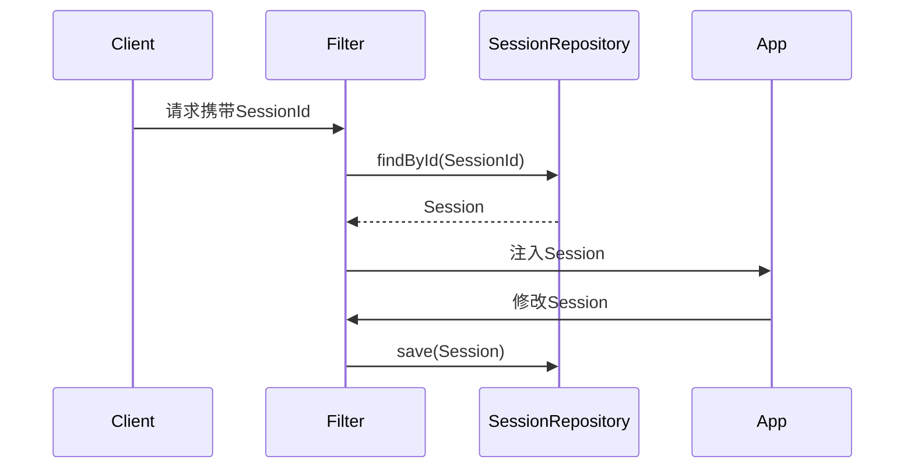

<!-- /**
 * Spring Session 详解
 * @description 分布式会话架构与Spring Session生态全景，核心原理、存储支持、源码、时序图、序列化与失效机制、跨域与SSO、安全机制、与Spring Security/Boot/Cloud集成、生产运维、最佳实践与FAQ，极致细化，适合架构师与高级开发者
 */ -->

# Spring Session 详解

---

## 1. 分布式会话架构与Spring Session生态全景

### 1.1 分布式会话场景与优势
- 多节点共享登录、横向扩展、无粘性负载均衡
- 解决Tomcat/JVM本地Session不共享、失效同步难题

### 1.2 Spring Session 生态组件
- SessionRepository、Session、SessionRepositoryFilter
- 支持存储：Redis、JDBC、Hazelcast、MongoDB等
- 集成：Spring Security、Spring Boot、Spring Cloud

### 1.3 架构图
```mermaid
graph TD
    A[Client] --> B[Gateway/LoadBalancer]
    B --> C[App1]
    B --> D[App2]
    C & D --> E[SessionRepository(Redis/JDBC...)]
```

---

## 2. 核心原理与源码极致细化

### 2.1 SessionRepository/Session/Filter原理
- SessionRepository：会话持久化接口，支持多种实现
- Session：会话对象，包含ID、属性、过期时间
- SessionRepositoryFilter：Servlet Filter，拦截请求，管理Session生命周期
- Cookie/Token：Session ID传递载体，支持自定义

### 2.2 源码与时序图

- 核心源码：SessionRepositoryFilter、RedisOperationsSessionRepository、JdbcOperationsSessionRepository

### 2.3 配置与实战
```java
@Configuration
@EnableRedisHttpSession(maxInactiveIntervalInSeconds = 1800)
public class SessionConfig { }
```

---

## 3. 支持的存储极致细化

### 3.1 Redis
- 高性能、分布式、支持过期、消息通知
- 配置：spring.session.store-type=redis
- 源码：RedisOperationsSessionRepository

### 3.2 JDBC
- 兼容性好，适合小规模集群
- 配置：spring.session.store-type=jdbc
- 源码：JdbcOperationsSessionRepository
- 建表SQL：
```sql
CREATE TABLE SPRING_SESSION (
  PRIMARY_ID CHAR(36) PRIMARY KEY,
  SESSION_ID CHAR(36) NOT NULL,
  CREATION_TIME BIGINT NOT NULL,
  LAST_ACCESS_TIME BIGINT NOT NULL,
  MAX_INACTIVE_INTERVAL INT NOT NULL,
  EXPIRY_TIME BIGINT NOT NULL,
  PRINCIPAL_NAME VARCHAR(100),
  CONSTRAINT SPRING_SESSION_UK UNIQUE (SESSION_ID)
);
CREATE TABLE SPRING_SESSION_ATTRIBUTES (
  SESSION_PRIMARY_ID CHAR(36) NOT NULL,
  ATTRIBUTE_NAME VARCHAR(200) NOT NULL,
  ATTRIBUTE_BYTES BYTEA NOT NULL,
  CONSTRAINT SPRING_SESSION_ATTRIBUTES_PK PRIMARY KEY (SESSION_PRIMARY_ID, ATTRIBUTE_NAME),
  CONSTRAINT SPRING_SESSION_ATTRIBUTES_FK FOREIGN KEY (SESSION_PRIMARY_ID) REFERENCES SPRING_SESSION(PRIMARY_ID) ON DELETE CASCADE
);
```

### 3.3 Hazelcast/MongoDB
- Hazelcast：内存分布式缓存，适合高并发
- MongoDB：文档型存储，适合大数据量
- 配置：spring.session.store-type=hazelcast/mongodb

---

## 4. Session序列化、失效、并发、过期、刷新、踢人下线极致细化

### 4.1 序列化机制
- 支持JDK、JSON、Kryo等多种序列化
- 配置：spring.session.redis.serializer=xxx

### 4.2 失效与过期
- maxInactiveIntervalInSeconds、Session超时自动清理
- Redis支持Keyspace通知，JDBC定时清理

### 4.3 并发与刷新
- 支持同一用户多端并发、Session刷新续期
- 配置：spring.session.redis.flush-mode=on-save/instant

### 4.4 踢人下线
- 后台/接口删除Session、强制失效
- 实战：SessionRepository.deleteById(sessionId)

---

## 5. 跨域、单点登录、会话同步极致细化

### 5.1 跨域Session
- 支持Cookie Domain配置、Token传递、前后端分离

### 5.2 单点登录（SSO）与多端同步
- Session共享、Token同步、OAuth2/JWT集成
- 实战：Spring Session + Spring Security + OAuth2

### 5.3 会话隔离
- 多租户、子系统隔离、Session命名空间

---

## 6. 安全机制极致细化

### 6.1 防劫持、防重放、防穿透
- HttpOnly、Secure、SameSite Cookie
- SessionId签名、加密、定期轮换
- Token防重放、接口签名

### 6.2 CSRF防护
- Spring Security集成CSRF Token
- 配置：spring.security.enable-csrf=true

### 6.3 攻防演练与自动化测试
- Session劫持脚本、重放攻击脚本、自动化安全测试

---

## 7. 与Spring Security/Boot/Cloud集成极致细化

### 7.1 Spring Security集成
- 自动替换原生Session、支持RememberMe、会话并发控制
- 配置：spring.session.store-type=redis

### 7.2 Spring Boot自动装配
- spring-boot-starter-session、自动注册Filter、配置优先级

### 7.3 Spring Cloud集成
- Gateway/Zuul Token透传、全局会话、微服务共享

### 7.4 监控与健康检查
- Actuator端点、Session统计、Prometheus监控、告警脚本

---

## 8. 生产环境部署、运维、CI/CD极致细化

### 8.1 Dockerfile/K8s部署YAML
- Dockerfile、k8s-deployment.yaml、健康检查、弹性伸缩

### 8.2 自动化运维与CI/CD
- Jenkinsfile、定时清理、失效告警、日志采集

---

## 9. 常见问题与FAQ、面试高频题、最佳实践极致细化

### 9.1 FAQ
- 如何实现分布式会话共享？
- 如何踢人下线？
- 如何防止Session劫持与重放？
- 如何与Spring Security/Cloud集成？
- 如何监控Session状态？

### 9.2 高频面试题与标准答案
- Q: Spring Session核心组件？
  A: SessionRepository、Session、SessionRepositoryFilter、支持多种存储、与Spring Security/Boot/Cloud集成。
- Q: 如何实现Session失效与踢人下线？
  A: 设置超时时间、后台/接口删除Session、SessionRepository.deleteById。
- Q: 如何防止Session劫持？
  A: HttpOnly、Secure、SameSite、SessionId签名、加密、定期轮换。
- Q: 如何与Spring Cloud Gateway集成？
  A: Token透传、全局Session、微服务共享。

### 9.3 最佳实践
- Session/Token/存储/安全分层设计
- 统一异常处理与告警
- 生产环境安全基线与自动化测试
- 自动化监控与运维

---

> 本文档已极致细化 Spring Session 全部核心与进阶知识点，适合企业级分布式会话架构设计、攻防实战与面试深度准备。 