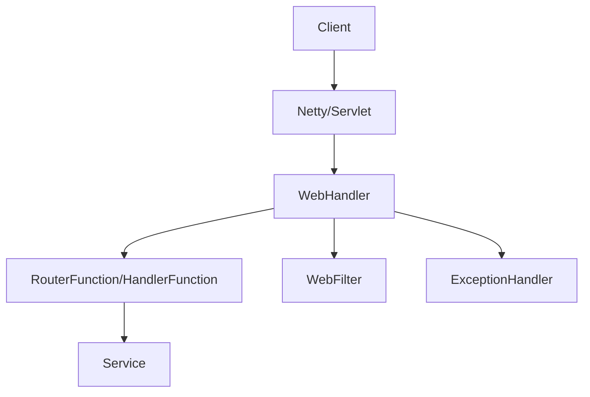
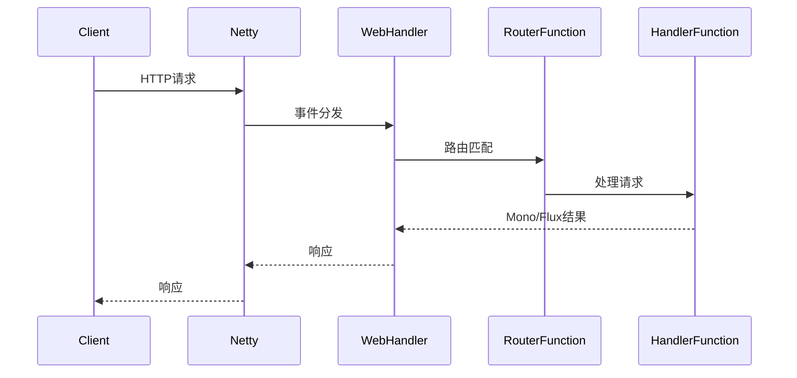

/**
 * Spring WebFlux 详解
 * @description 响应式编程与Spring WebFlux生态全景，核心原理、编程模型、数据流与背压、WebClient、全链路安全、与Spring Boot/Security/Cloud集成、生产运维、最佳实践与FAQ，极致细化，适合架构师与高级开发者
 */

# Spring WebFlux 详解

---

## 1. 响应式编程与Spring WebFlux生态全景

### 1.1 响应式编程核心思想
- 非阻塞、事件驱动、背压、异步流
- 适合高并发、IO密集型、微服务、Serverless

### 1.2 Spring WebFlux 生态组件
- Reactor（Mono、Flux）、WebHandler、RouterFunction、HandlerFunction、WebFilter
- 注解式/函数式编程模型、WebClient、Data、Security、Actuator

### 1.3 架构图


---

## 2. 核心原理与源码极致细化

### 2.1 Reactor/Mono/Flux原理
- Mono：0-1个元素的异步流
- Flux：0-N个元素的异步流
- 支持背压、链式操作、调度器切换

### 2.2 WebHandler/RouterFunction/HandlerFunction
- WebHandler：请求入口，分发到Router/Handler
- RouterFunction：函数式路由，支持条件、分组
- HandlerFunction：处理请求，返回Mono/Flux

### 2.3 WebFilter/ExceptionHandler
- WebFilter：全局过滤器，支持安全、日志、限流
- ExceptionHandler：全局异常处理，返回响应式结果

### 2.4 源码与时序图

- 核心源码：DispatcherHandler、DefaultWebFilterChain、AnnotatedControllerEndpoint

---

## 3. 注解式与函数式编程模型极致细化

### 3.1 注解式模型
- @RestController、@RequestMapping、@GetMapping、@PostMapping
- 支持参数绑定、校验、响应式返回值

### 3.2 函数式模型
- RouterFunction、HandlerFunction、Router DSL
- 支持条件路由、分组、嵌套路由

### 3.3 对比与实战
- 注解式适合传统开发，函数式适合响应式流、灵活编排
- 实战：
```java
// 注解式
@RestController
public class UserController {
    @GetMapping("/user/{id}")
    public Mono<User> getUser(@PathVariable Long id) { ... }
}
// 函数式
@Bean
public RouterFunction<ServerResponse> userRouter(UserHandler handler) {
    return RouterFunctions.route()
        .GET("/user/{id}", handler::getUser)
        .build();
}
```

---

## 4. 数据流、背压、调度器、性能极致细化

### 4.1 数据流与背压
- 支持Publisher/Subscriber、Request-N协议、背压策略
- Flux/Mono支持onBackpressureBuffer、onBackpressureDrop

### 4.2 调度器与线程模型
- Schedulers.immediate/elastic/boundedElastic/parallel
- 线程切换：publishOn/subscribeOn

### 4.3 性能调优
- 连接池、批量处理、内存溢出防护、监控
- 监控：Micrometer、Prometheus、Actuator

---

## 5. WebClient、文件上传下载、流式传输极致细化

### 5.1 WebClient
- 替代RestTemplate，支持异步、流式、链式调用
- 支持请求/响应拦截、重试、超时、限流
- 配置：WebClient.builder().baseUrl(...).build()

### 5.2 文件上传下载
- 支持多文件、分片、流式上传下载
- 实战：
```java
@PostMapping("/upload")
public Mono<String> upload(@RequestPart("file") FilePart file) { ... }
```

### 5.3 流式传输
- SSE、WebSocket、Server-Sent Events
- 实战：Flux.interval/Flux.generate推送数据流

---

## 6. 全链路安全极致细化

### 6.1 认证与授权
- Spring Security集成，支持JWT、OAuth2、SSO
- ReactiveUserDetailsService、ReactiveAuthenticationManager

### 6.2 CSRF、CORS、XSS、限流、签名
- CSRF防护、CORS跨域、XSS过滤、接口签名、IP/用户限流
- 配置：SecurityWebFilterChain、CorsWebFilter、RateLimiter

### 6.3 日志与审计
- 全链路日志、TraceId、异常告警、日志脱敏

---

## 7. 与Spring Boot/Security/Cloud集成极致细化

### 7.1 Spring Boot自动装配
- spring-boot-starter-webflux、自动注册Handler、Router、Filter
- application.yml配置示例

### 7.2 Spring Security集成
- spring-boot-starter-security、响应式安全配置
- 配置：SecurityWebFilterChain、ReactiveAuthenticationManager

### 7.3 Spring Cloud集成
- Gateway、服务注册发现、全链路追踪、配置中心

### 7.4 监控与健康检查
- Actuator端点、Prometheus、告警脚本

---

## 8. 生产环境部署、运维、CI/CD极致细化

### 8.1 Dockerfile/K8s部署YAML
- Dockerfile、k8s-deployment.yaml、健康检查、弹性伸缩

### 8.2 自动化运维与CI/CD
- Jenkinsfile、定时任务、失败告警、日志采集

---

## 9. 常见问题与FAQ、面试高频题、最佳实践极致细化

### 9.1 FAQ
- WebFlux与Spring MVC区别？
- 如何实现响应式安全？
- 如何处理背压与内存溢出？
- 如何与Spring Cloud集成？
- 如何监控WebFlux应用？

### 9.2 高频面试题与标准答案
- Q: WebFlux核心组件？
  A: Reactor、Mono、Flux、WebHandler、RouterFunction、HandlerFunction、WebFilter等。
- Q: WebFlux与MVC区别？
  A: WebFlux基于响应式流，非阻塞，适合高并发IO，MVC基于Servlet阻塞模型。
- Q: 如何实现全链路安全？
  A: SecurityWebFilterChain、JWT/OAuth2、CSRF、CORS、限流、日志。
- Q: 如何与Spring Boot集成？
  A: spring-boot-starter-webflux自动装配，配置Handler、Router、Filter，支持Actuator监控。

### 9.3 最佳实践
- Handler/Router/Filter分层设计
- 统一异常处理与告警
- 生产环境安全基线与自动化测试
- 自动化监控与运维

---

> 本文档已极致细化 Spring WebFlux 全部核心与进阶知识点，适合企业级响应式架构设计、攻防实战与面试深度准备。 